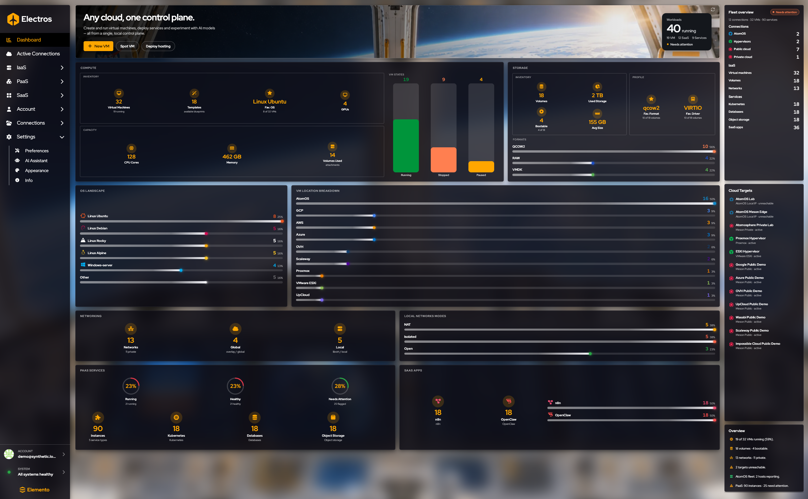
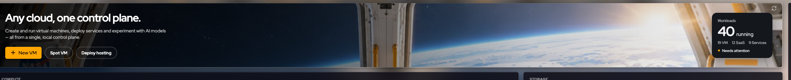
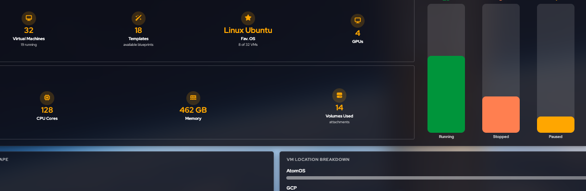
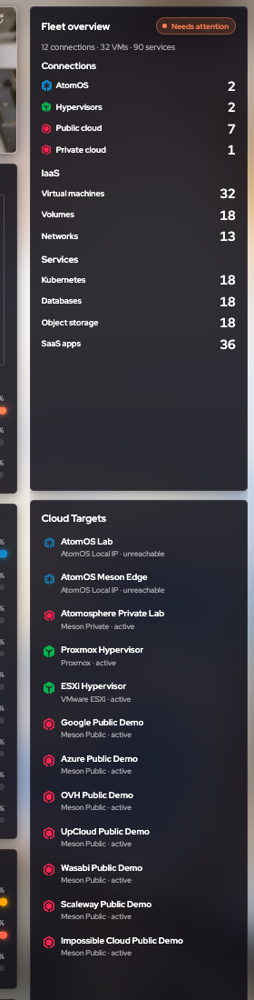

# Dashboard

Le tableau de bord est la page d'accueil. La bannière affiche **Any cloud, one control plane.** Il ne crée pas de ressources par lui-même. Il vous indique si la flotte est en bonne santé et vous donne des raccourcis vers les assistants de création.

## À quoi sert cette page

Le tableau de bord répond à trois questions avant d'ouvrir un assistant : la flotte est-elle active, où sont les machines, et de quel raccourci ai-je besoin. Il ne modifie pas une VM, un disque ou une facture. Cela se fait sur leurs pages respectives. Utilisez-le comme contrôle du matin, puis passez à l'action.

## Raccourcis dans l'en-tête

<figure class="zoom">
  
  <figcaption><strong>+ New VM</strong> est l'action principale. <strong>Spot VM</strong> et <strong>Deploy hosting</strong> sont les deux autres raccourcis. La carte à droite compte les charges de travail en cours et active <strong>Needs attention</strong> lorsqu'un élément est en mauvais état.</figcaption>
</figure>

| Bouton | Ouvre |
|--------|--------|
| **+ New VM** | [Créer une machine virtuelle de base](./07-iaas-virtual-machines#vm-de-base) |
| **Spot VM** | [Créer une spot VM](./08-iaas-ephemeral-vms#en-creer-une) |
| **Deploy hosting** | Un flux de création d'hébergement / service |

La petite carte en haut à droite compte les charges de travail en cours (VM, SaaS, services) et signale **Needs attention** lorsqu'un élément est en mauvais état. C'est un résumé, pas une liste modifiable.

## Comment lire les panneaux

Lisez de gauche à droite, puis la colonne de droite.

<figure class="zoom">
  
  <figcaption>Inventory donne des compteurs. Capacity donne les cœurs, la mémoire et les volumes attachés. Les barres sont l'état d'alimentation : vert running, orange stopped, jaune paused.</figcaption>
</figure>

**Compute.** Inventory indique combien de machines virtuelles, de modèles et de GPU vous avez, plus le système d'exploitation le plus courant. Capacity indique les cœurs, la mémoire et les volumes utilisés. **VM states** répartit la flotte en trois barres : vert **Running**, orange **Stopped**, jaune **Paused**.

**Storage.** Combien de volumes, combien d'espace ils utilisent, combien sont amorçables, et quels format de disque et pilote dominent (souvent qcow2 et virtio). Les barres sous la carte storage sont un mélange de formats (QCOW2, RAW, VMDK), pas une alarme d'utilisation.

**OS landscape.** Répartition des invités par système d'exploitation. Utile lorsque vous êtes sur le point de standardiser les images.

**VM location breakdown.** Où ces VM s'exécutent réellement : AtomOS, un hyperviseur ou un cloud public. Si un fournisseur attendu manque, la cible est probablement désactivée sous [Active Connections](./03-my-clouds).

**Networking.** Nombre de réseaux, et combien sont globaux versus locaux. **Local network modes** affiche NAT, isolated et open.

**PaaS services et SaaS apps.** Anneaux pour running, healthy et needs-attention, puis compteurs par produit (Kubernetes, bases de données, stockage objet, n8n, OpenClaw). Ouvrez la page correspondante de la barre latérale pour agir sur une instance.

## La colonne de droite

<figure class="zoom">
  
  <figcaption><strong>Fleet overview</strong> raconte la même histoire que les panneaux, dans une seule liste. <strong>Cloud targets</strong> est la joignabilité : active signifie que vous pouvez y placer une charge de travail, unreachable signifie que cet hôte manquera ou échouera dans un assistant.</figcaption>
</figure>

**Fleet overview** regroupe la même flotte en une colonne : Connections, IaaS, PaaS et SaaS, chacune avec un compteur.

**Cloud targets** est la liste de joignabilité. Un point vert signifie qu'Electros peut parler à cet hôte. Un point rouge signifie unreachable — les créations qui ont besoin de cet hôte échoueront ou l'omettront. Corrigez le réseau, le daemon ou l'enregistrement de la cible avant de réessayer un assistant.

Les lignes en bas répètent les chiffres principaux en phrases (par exemple combien de VM sont en cours d'exécution, combien de cibles sont hors service).

## Quand le tableau de bord paraît vide

Une flotte vide dessine tout de même les panneaux, avec des zéros. Ce n'est pas un bug. Ajoutez une cible sous Connections, activez-la sous Active Connections, puis créez une VM ou un volume. Rechargez le tableau de bord ensuite si les chiffres ne bougent pas.
