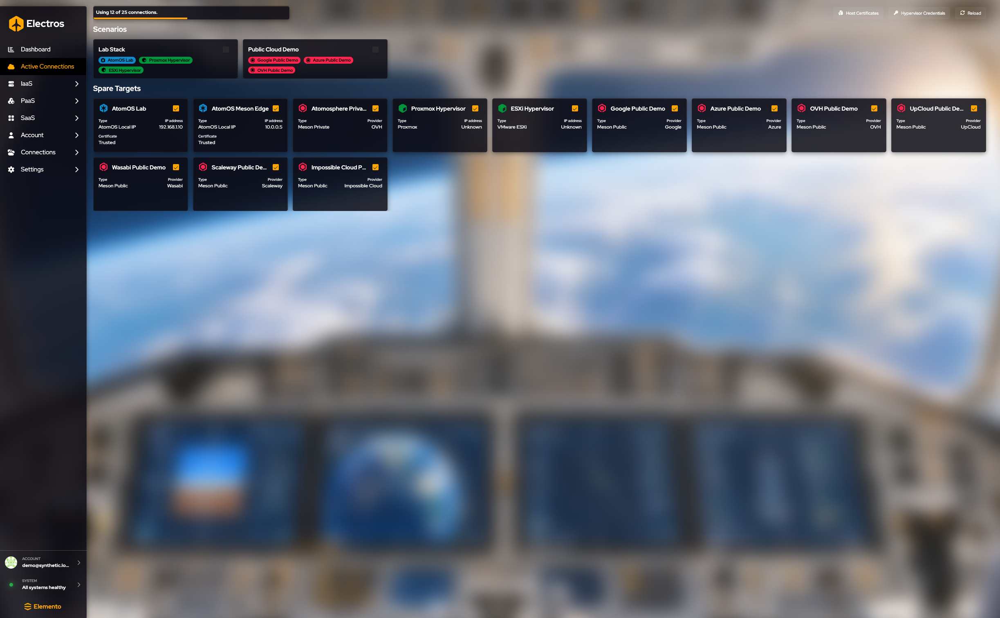
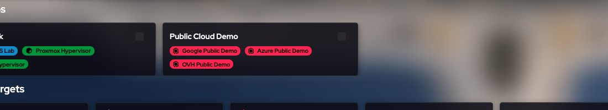

# Active Connections

Cette page décide quels hôtes et scénarios Electros utilisera **maintenant**. Enregistrer une cible (sous Connections) ne l'active pas. L'activer ici le fait.

## À quoi sert cette page

Enregistrer un hôte sous Connections ne fait que le stocker. Cette page décide lesquels de ces hôtes Electros contactera réellement dans cette session. Une cible désactivée n'apparaît pas dans les sélecteurs d'hôte, et ses VM et disques disparaissent des listes IaaS. Activez un scénario lorsque vous voulez tout un labo d'un coup. Activez une cible libre lorsque vous voulez seulement cette machine.

## Le quota

La barre en haut indique combien de connexions vous utilisez par rapport à la limite du plan, par exemple « Using 12 of 25 connections. » Activer une autre cible échoue lorsque vous êtes déjà au plafond. Désactivez-en une que vous n'utilisez pas, ou changez de plan, avant d'en ajouter davantage.

## Scénarios

<figure class="zoom">
  
  <figcaption>Chaque carte est un ensemble. Les pastilles colorées sont les cibles qu'il contient. La case à cocher active tout l'ensemble. Les pastilles suivent la couleur de la cible : bleu AtomOS, vert hyperviseur, rouge cloud public.</figcaption>
</figure>

Un scénario est un ensemble nommé de cibles (une pile de labo, une démo cloud public, etc.). Activer un scénario active toutes les cibles de cet ensemble et est le moyen le plus rapide de changer de contexte.

Les cibles requises par le scénario **actuel** apparaissent verrouillées. Vous ne pouvez pas les désactiver individuellement. Passez à un scénario qui ne les inclut pas, ou modifiez le scénario, puis désactivez la cible.

Créez et modifiez les scénarios sous [Connections](./04-connections#creer-un-scenario).

## Cibles libres

Sous les scénarios, chaque carte est un hôte qui n'est pas lié exclusivement à la vue scénario : AtomOS, un hyperviseur, ou un cloud public ou privé.

| Sur la carte | Signification |
|-------------|---------|
| Nom | Quelle cible |
| Type | AtomOS sur une IP locale, Meson public, Meson privé, Proxmox, ESXi, etc. |
| Adresse IP ou fournisseur | L'adresse d'un hôte local, ou le nom du cloud |
| Certificat | Si le certificat d'un hôte AtomOS est de confiance |

Cliquez sur une carte de cible libre pour l'activer ou la désactiver. Si Electros refuse, cette cible est requise par le scénario actif.

## Barre d'outils

| Contrôle | Ce qu'il fait |
|---------|----------------|
| **Host Certificates** | Examiner ou faire confiance aux certificats d'hôtes AtomOS |
| **Hypervisor Credentials** | Stocker le nom d'utilisateur et le mot de passe utilisés lorsqu'une cible Proxmox ou ESXi est activée |
| **Reload** | Demander au daemon des cibles une liste à jour |

## Détail de l'hôte

Ouvrez le détail d'une cible lorsque vous avez besoin de l'état en direct de l'hôte (CPU, mémoire, disques sur cette machine) plutôt que de l'interrupteur marche/arrêt. Revenez ici pour l'activer ou la désactiver.
