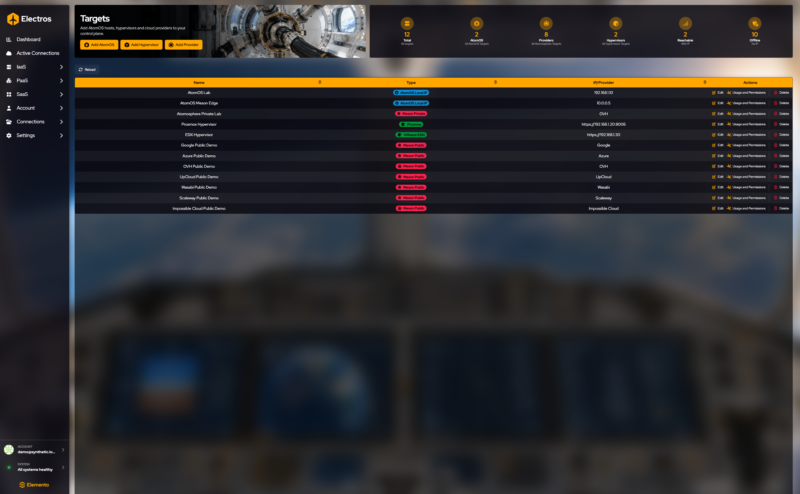
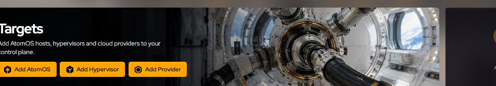
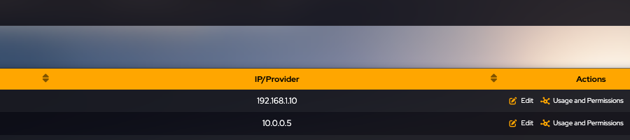
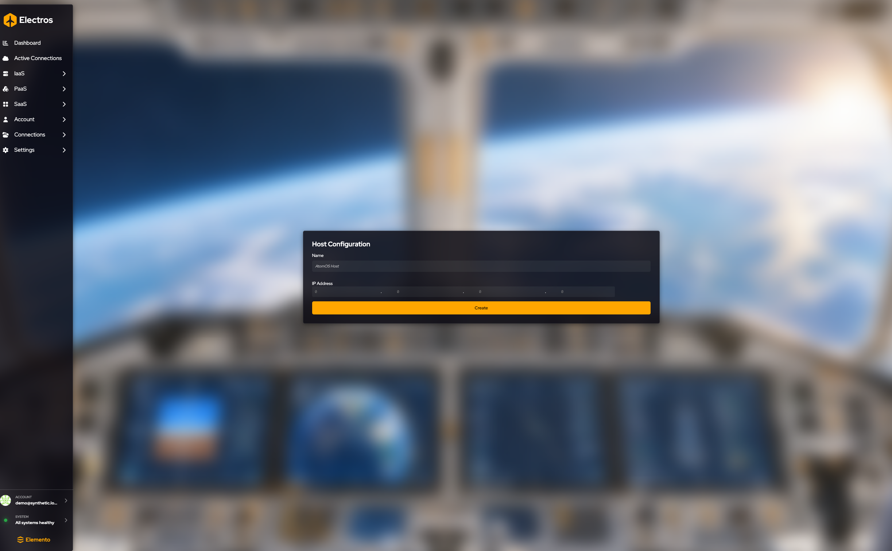
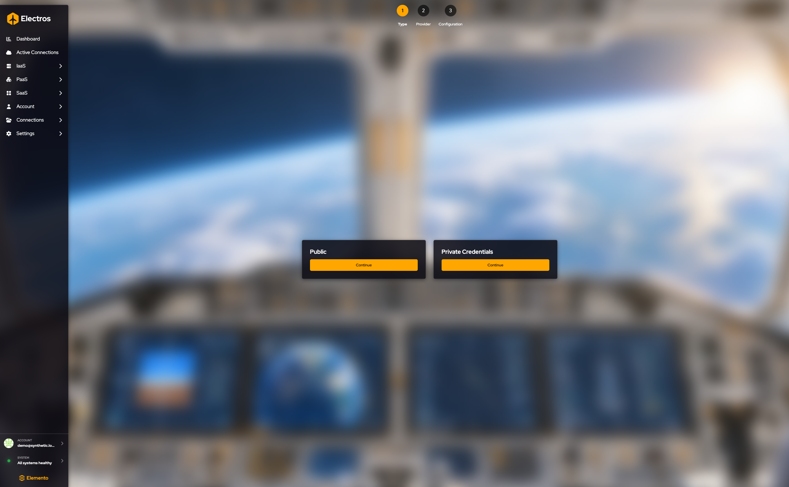
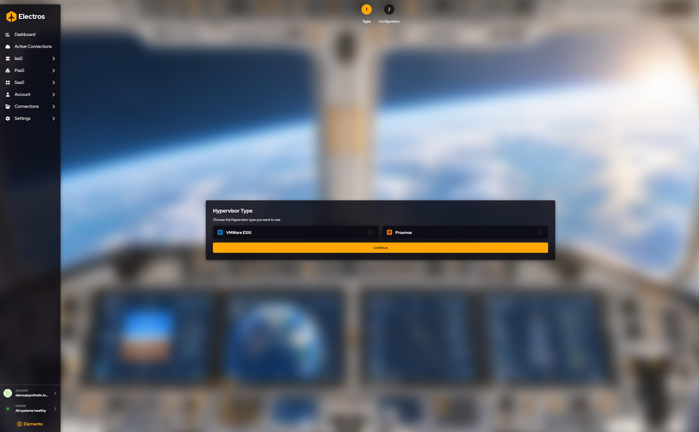
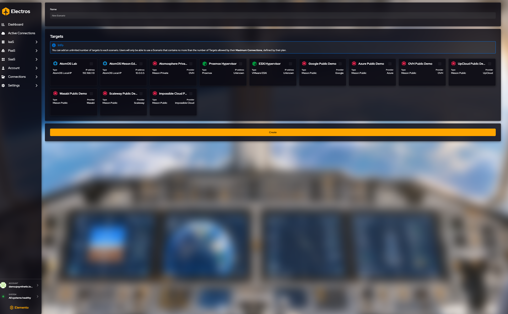
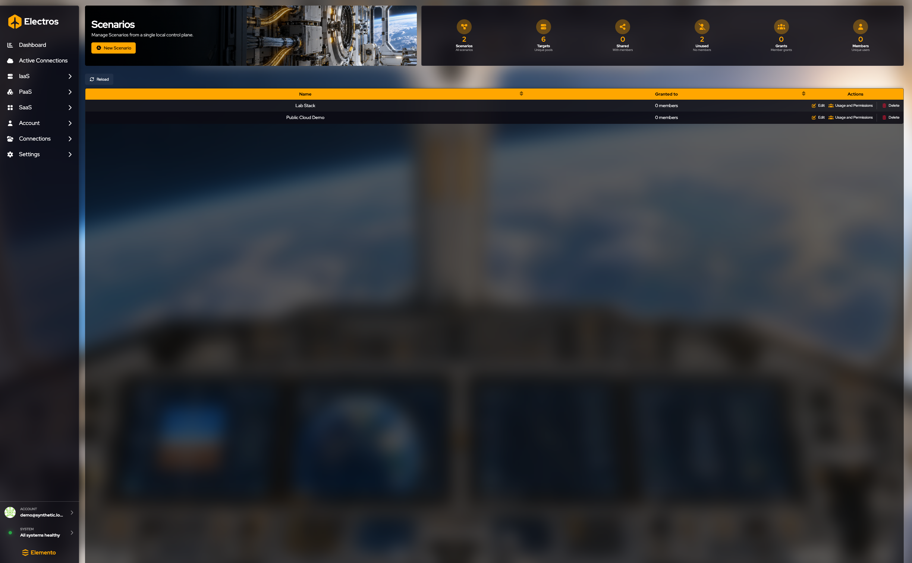

# Connections

Connections est l'endroit où un administrateur d'organisation **enregistre** des hôtes et les regroupe en scénarios. Les activer pour le travail quotidien se fait sur [Active Connections](./03-my-clouds), pas ici.

Vous ne voyez cette section que si votre rôle peut gérer l'organisation.

## Targets

## À quoi sert cette page

Targets est le carnet d'adresses. Rien ici ne démarre une VM. Vous enregistrez les machines et comptes cloud qu'Electros est autorisé à utiliser, puis vous les activez sur Active Connections. Si un hôte manque dans un assistant, il n'a jamais été ajouté ici, ou il a été ajouté et laissé désactivé.

<figure class="zoom">
  
  <figcaption>Trois entrées. <strong>Add AtomOS</strong> est une machine sur votre réseau. <strong>Add Hypervisor</strong> est Proxmox ou ESXi. <strong>Add Provider</strong> est un compte Meson cloud public ou privé.</figcaption>
</figure>

Le tableau liste toutes les cibles cloud connues de l'organisation. Les colonnes sont **Name**, **Type** (AtomOS Local, Meson Public, Meson Private, Proxmox, VMware ESXi) et **IP/Provider**.

Les jauges au-dessus du tableau comptent Total, AtomOS, Providers, Hypervisors, Reachable et Offline. Reachable et Offline correspondent aux points verts et rouges du tableau de bord.

**Add** depuis les boutons de la page. Les étapes de chaque assistant sont ci-dessous.

<figure class="zoom">
  
  <figcaption><strong>Edit</strong> modifie le nom et l'adresse stockés. <strong>Usage and Permissions</strong> choisit qui dans l'organisation peut utiliser la cible. <strong>Delete</strong> est l'action rouge sur la même ligne.</figcaption>
</figure>

### Ce que vous pouvez faire sur une ligne

- **Edit** modifie le nom et l'adresse que vous avez stockés. Cela ne reconstruit pas l'hôte.
- **Usage and Permissions** choisit quels membres de l'organisation peuvent utiliser cette cible. La cible doit d'abord exister.
- **Delete** vous demande de saisir le nom de la cible. Annulez si vous vouliez seulement voir la boîte de dialogue. Supprimer une cible la retire des scénarios et des sélecteurs d'hôte.

Le premier contact avec un nouvel hôte AtomOS peut afficher une **empreinte de certificat**. Comparez-la avec la machine attendue, puis approuvez ou refusez. Electros n'utilisera pas un hôte non fiable pour les créations.

## Enregistrer une connexion

### Ajouter un hôte AtomOS

**Où :** Targets → **Add AtomOS**

1. **Name** — obligatoire. Quelque chose que vous reconnaîtrez dans les listes d'hôtes, par exemple le labo ou le site.
2. **IP address** — obligatoire. `0.0.0.0` est rejeté.
3. **Create** vous ramène à la liste des cibles.

La première fois qu'Electros parle à cette IP, une **empreinte de certificat** peut s'afficher. Comparez-la avec l'hôte attendu, puis approuvez ou refusez. N'approuvez pas une empreinte que vous ne pouvez pas vérifier.

---

### Ajouter un fournisseur cloud (Meson)

**Où :** Targets → **Add Provider**

#### Compte public

Utilisez ceci lorsque votre organisation autorise déjà une démo ou un compte cloud public partagé.

1. Choisissez **Public**.
2. Cochez les fournisseurs qu'Electros doit utiliser. Seuls les fournisseurs autorisant l'usage public sont listés. Une case déjà cochée signifie que ce fournisseur est déjà connecté.
3. **Conclude** ajoute ceux que vous avez cochés et retire ceux que vous avez décochés.

#### Compte privé

Utilisez ceci pour vos propres identifiants cloud (bring your own account). Les guides détaillés pour chaque fournisseur sont sous [Identifiants Meson privé](./private-meson/).

1. Choisissez **Private**.
2. Sélectionnez **un** fournisseur.
3. **Target name** — obligatoire.
4. Remplissez le formulaire d'identifiants. Les champs dépendent du fournisseur (clés API, ID de projet, etc.). Traitez chaque valeur comme un secret. Voir [Google](./private-meson/google), [Azure](./private-meson/azure), [OVH](./private-meson/ovh), [UpCloud](./private-meson/upcloud), [Wasabi](./private-meson/wasabi), [Scaleway](./private-meson/scaleway), [Impossible Cloud](./private-meson/impossiblecloud), [Oracle Cloud](./private-meson/oracle) ou [AWS](./private-meson/aws).
5. **Conclude**.

---

### Ajouter un hyperviseur

**Où :** Targets → **Add Hypervisor**

1. Choisissez **VMware** (ESXi 6 ou 7) ou **Proxmox** (VE 7 ou 8).
2. **Target name** — obligatoire.
3. **Host URL** — obligatoire, et doit commencer par `http://` ou `https://`. Exemple de forme : `https://192.168.0.42:8006`.
4. **Create**.

Vous ne saisissez pas le mot de passe de l'hyperviseur ici. Electros demande les identifiants plus tard, lorsque vous activez la cible.

---

### Créer un scénario

Un scénario est un ensemble nommé de cibles que vous pouvez activer ensemble depuis **Active Connections**.

**Où :** Scenarios → **New Scenario** (le même écran modifie un scénario existant)

1. **Name** le scénario.
2. Cochez les cartes de cibles qui en font partie. Vous pouvez n'en sélectionner aucune, mais un scénario sans cibles ne sert à rien. Le **maximum de connexions** de votre plan plafonne combien vous pouvez en activer à la fois — l'encadré d'info du formulaire indique la limite.
3. **Create** (ou **Update** si vous avez ouvert un scénario existant).

Pour l'utiliser, allez dans Active Connections et activez le scénario. Les cibles requises par le scénario actif ne peuvent pas être désactivées individuellement tant que vous ne changez pas de scénario.

## Scenarios

Un scénario est une liste de cibles que vous voulez activer ensemble (« Lab Stack », « Public Cloud Demo »). Les colonnes du tableau sont **Name** et **Granted to**. Les jauges comptent Scenarios, Targets, Shared, Unused, Grants et Members.

| Action | Ce qui se passe |
|--------|----------------|
| **New Scenario** | Ouvre le formulaire de création. Les étapes sont sous [Créer un scénario](#creer-un-scenario) |
| **Edit** sur une ligne | Le même formulaire, avec le nom et les cases déjà remplis |
| **Usage and Permissions** | Qui peut utiliser ce scénario |
| **Delete** | Demande de saisir le nom du scénario. Annulez pour le conserver |

Après avoir enregistré un scénario, allez dans Active Connections et activez-le. Jusque-là, les cibles qu'il contient restent des cartes libres.
