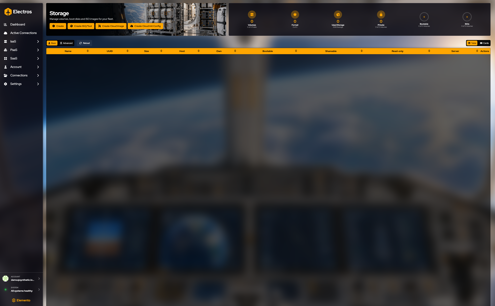
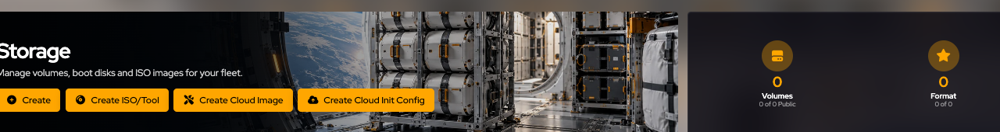
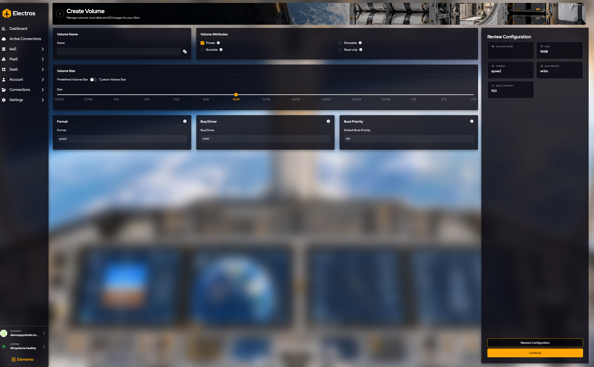
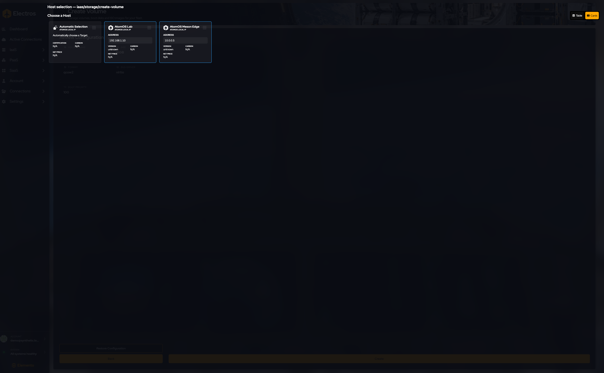
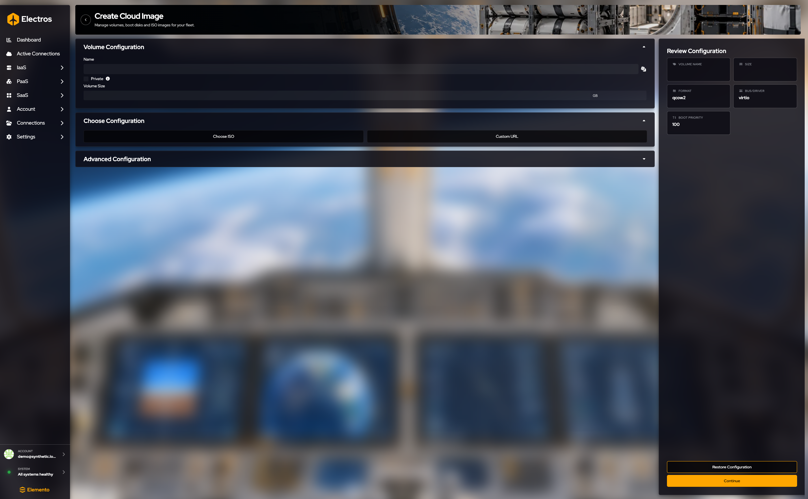
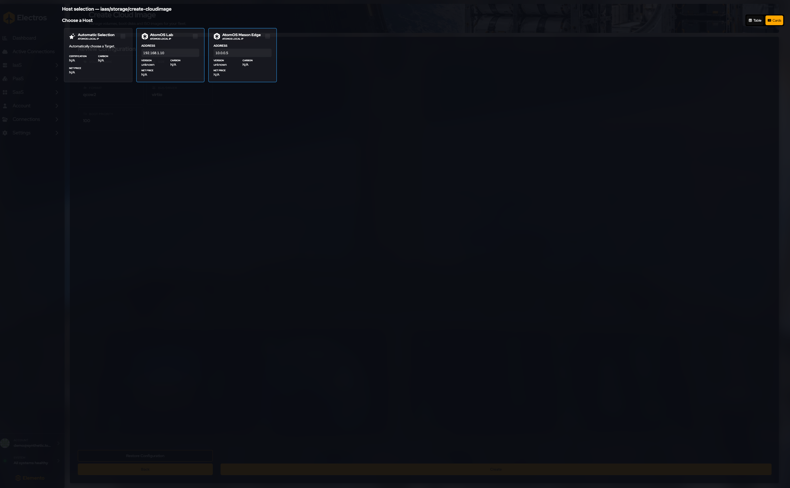
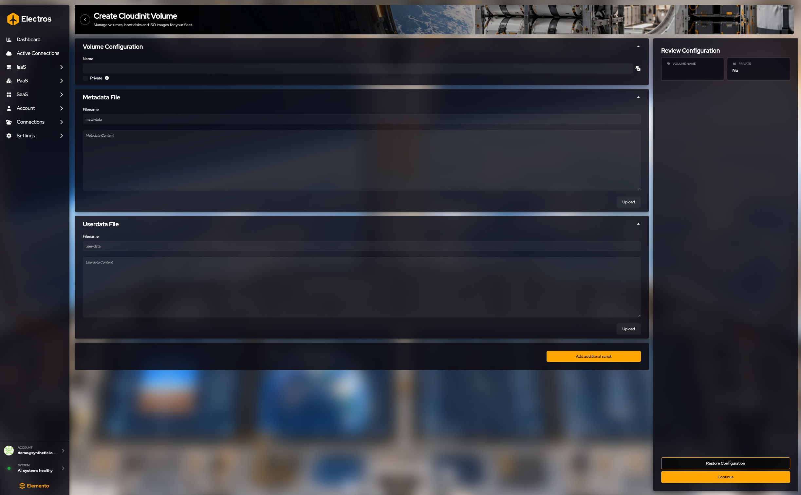
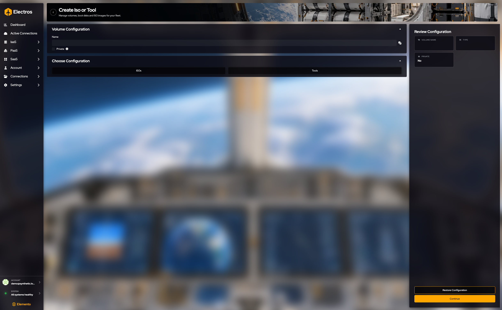

# Storage

Storage est l'inventaire des disques qu'Electros peut attacher aux machines virtuelles : volumes vides, images cloud, configs cloud-init, et images ISO ou outils.

## À quoi sert cette page

Storage est le catalogue de disques. Une machine virtuelle n'apporte pas son propre disque vide sauf si vous en attachez un. Vous créez le volume ici, sur un hôte capable d'exécuter du stockage en blocs, puis vous l'attachez lors de la création ou de la modification d'une VM. Les images cloud et les images ISO sont aussi des volumes : c'est ainsi qu'un invité obtient un installateur ou un disque racine prêt à l'emploi.

La bannière le dit directement : gérez les volumes, les disques d'amorçage et les images ISO de votre flotte.

<figure class="zoom">
  
  <figcaption><strong>Create</strong> est un disque vide. <strong>Create ISO/Tool</strong> pointe vers un installateur ou une image outil. <strong>Create Cloud Image</strong> construit un disque à partir du catalogue OS. <strong>Create Cloud Init Config</strong> est un petit volume de fichiers de premier démarrage. Les jauges à droite comptent ce que vous avez déjà.</figcaption>
</figure>

## Lire la page

Les jauges en haut comptent **Volumes**, **Format**, **Used Storage**, **Private**, **Bootable** et **ISOs**.

Les colonnes du tableau sont **Name**, **UUID**, **Size**, **Host**, **Own**, **Bootable**, **Shareable**, **Read-only**, **Server** et **Actions**. Cliquez sur un UUID pour le copier.

**Table** est la liste compacte. **Advanced** affiche davantage de chaque volume. **Reload** récupère une copie à jour. **Table** et **Cards** à droite basculent la façon dont le même inventaire est dessiné. Les cartes sont plus faciles à parcourir lorsque vous avez une poignée de disques ; le tableau est plus pratique lorsque vous triez par taille ou par hôte.

## Créer un disque

Les boutons sous le titre ouvrent un assistant. Chacun demande une description, puis un hôte ([Comment fonctionne la création](./01-getting-started#comment-fonctionne-la-creation)). N'appuyez pas sur **Create** à la fin de l'assistant sauf si vous voulez que le disque soit alloué sur cet hôte.

### Volume vide

**Où :** Storage → **Create**

Parcourez le formulaire de haut en bas. La revue à droite répète le nom, la taille, le format, le bus et la priorité d'amorçage.

1. **Name** le volume, ou utilisez le dé. Obligatoire.
2. **Size.** Restez sur **Predefined** et faites glisser le curseur (il démarre à **16 GB**, entre 256 MB et 4 TB). Passez à **Custom** si vous avez besoin d'une taille absente du curseur, et saisissez-la dans le champ mémoire.
3. **Qui peut l'utiliser.**
   - **Private** démarre **activé**. Désactivez-le uniquement si chaque utilisateur de cet hôte doit voir le disque.
   - **Shareable** et **Bootable** ne peuvent pas être tous les deux activés. Un disque bootable est un disque depuis lequel une VM peut démarrer. Un disque shareable peut être attaché à plus d'une VM.
   - **Read-only** empêche les invités d'écrire.
4. **Format** démarre à **qcow2**. Choisissez **raw** si vous avez besoin d'un fichier plat.
5. **Bus / driver** démarre à **virtio**. Utilisez sata, ide ou scsi uniquement lorsque l'invité l'exige.
6. **Boot priority** démarre à **100**. Les numéros plus bas démarrent en premier (0 est le premier).

Appuyez sur **Continue**.

Choisissez une carte d'hôte. Si un hôte cloud affiche **Update Required**, cette cible ne peut pas créer ce volume tant qu'elle n'est pas mise à jour — choisissez un autre hôte ou mettez-le à jour d'abord. Arrêtez-vous avant **Create**.

---

### Image cloud

**Où :** Storage → **Create Cloud Image**

1. Nom, et éventuellement marquer **Private**.
2. Définissez **Volume size** en Go si l'image doit être plus grande que la source.
3. Choisissez comment Electros trouve l'image :
   - **ISO** — choisissez la famille OS, la variante et la version dans le catalogue.
   - **Custom URL** — collez une URL directe. Une URL vide est rejetée.
4. Sous les options avancées, le format démarre à **qcow2**, le bus à **virtio**, la priorité d'amorçage à **100**.

Review affiche le nom, la taille, le format, le bus et la priorité d'amorçage. **Continue**, puis choisissez un hôte.

---

### Volume cloud-init

**Où :** Storage → **Create Cloud Init Config**

Ce volume n'est pas un gros disque de données. Il porte les fichiers qu'un invité lit au premier démarrage.

1. Nommez le volume. **Private** démarre désactivé.
2. **Metadata** s'appelle toujours `meta-data`. Saisissez le YAML, ou appuyez sur **Upload** et choisissez un fichier sur votre ordinateur. La boîte de dialogue de fichier est en dehors d'Electros — vous devez choisir le fichier vous-même.
3. **User data** s'appelle toujours `user-data`. Même choix : saisissez-le ou téléversez-le.
4. **Add additional script** si l'invité a besoin de fichiers supplémentaires. Chacun a son propre nom de fichier, texte et bouton d'upload.

La revue ne confirme que le nom et si le volume est privé. Si les deux fichiers sont vides, Electros vous demande de confirmer avant de continuer — c'est attendu, pas une erreur.

**Continue**, choisissez un hôte, arrêtez-vous avant **Create**. Ne téléversez pas de fichiers contenant de vrais mots de passe si vous capturez des écrans.

---

### ISO ou outil

**Où :** Storage → **Create ISO/Tool**

1. Nommez le volume. **Private** démarre désactivé.
2. Choisissez **ISOs** ou **Tools**. Vous devez en choisir un avant la création.
3. Si vous avez choisi ISOs, parcourez le catalogue : famille, variante, version. Seules les entrées qui ont réellement une URL ISO sont listées.
4. Si vous avez choisi Tools, choisissez le type d'outil, la famille OS, puis l'outil.

Review affiche le nom, le type, et s'il est privé. **Continue**, choisissez un hôte, arrêtez-vous avant **Create**.

## Travailler avec un volume déjà existant

**Delete** se trouve sur la ligne. Clic droit sur la ligne pour le reste :

| Action | Ce qu'elle fait |
|--------|----------------|
| **Edit** | Modifie des drapeaux tels que le nom ou la priorité d'amorçage, selon ce que l'hôte autorise |
| **Resize** | Agrandit le volume. Vous ne pouvez pas réduire en dessous des données déjà présentes |
| **Convert** | Change le format sur disque (par exemple vers qcow2) |
| **Delete** | Demande une confirmation. Annulez si vous l'avez ouvert par erreur. Détachez un volume d'une VM en cours d'exécution avant de le supprimer |
