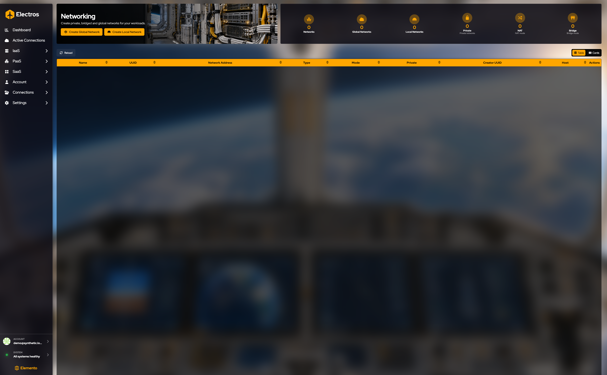
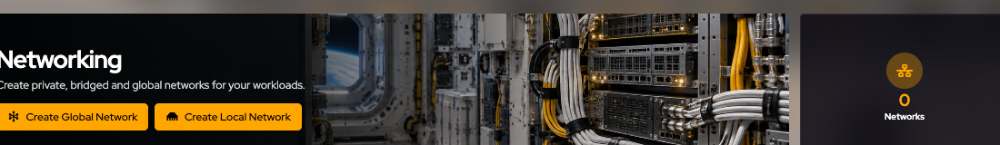
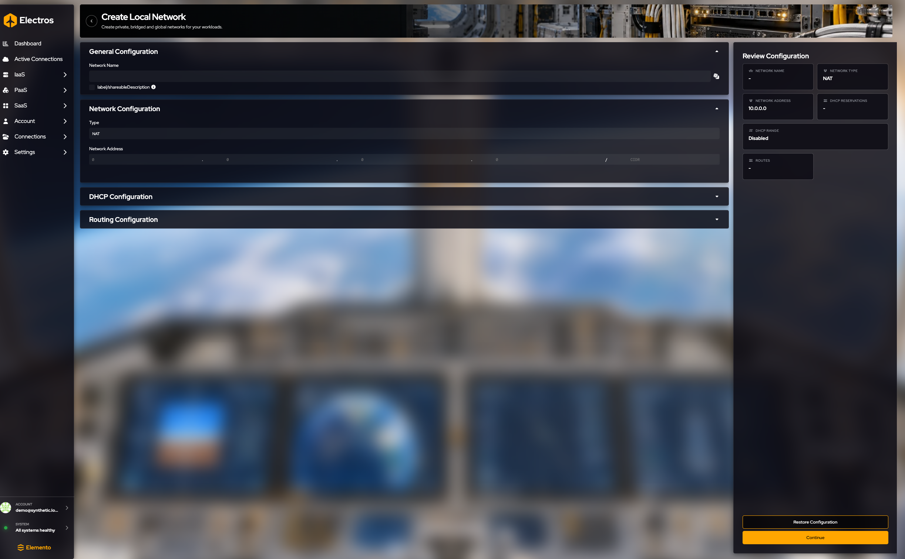
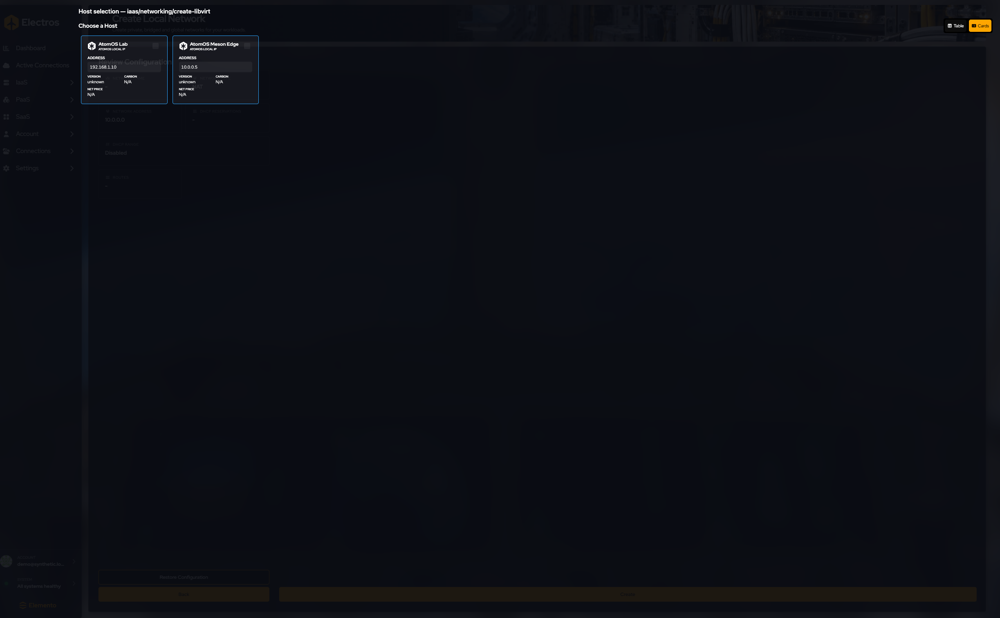
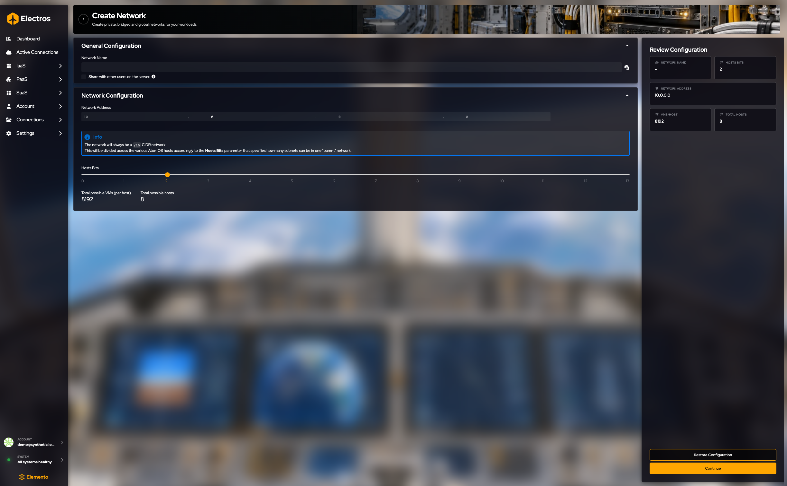

# Networking

Networking liste tous les réseaux qu'Electros connaît : réseaux libvirt locaux et réseaux Tailscale globaux.

## À quoi sert cette page

Une VM sans réseau peut démarrer et n'avoir nulle part où aller. Cette page est la liste des réseaux que vous pouvez attacher : des réseaux libvirt privés qui vivent sur un hôte ou quelques hôtes, et des réseaux Tailscale qui peuvent s'étendre sur plusieurs sites. Vous créez le réseau ici, puis vous l'attachez depuis la machine virtuelle.

<figure class="zoom">
  
  <figcaption><strong>Create Global Network</strong> est Tailscale. <strong>Create Local Network</strong> est libvirt sur les hôtes que vous choisissez. La phrase sous le titre décrit le rôle de la page : réseaux privés, bridgés et globaux pour vos charges de travail.</figcaption>
</figure>

## Lire la page

Les jauges comptent **Networks**, **Global Networks**, **Local Networks**, **Private**, **NAT** et **Bridge**.

Les colonnes du tableau sont **Name**, **UUID**, **Network Address**, **Type**, **Mode**, **Private**, **Creator UUID**, **Host** et **Actions**. **Reload** actualise la liste. **Table** et **Cards** à droite basculent la disposition.

## Créer un réseau

| Bouton | Ce que vous obtenez |
|--------|----------------|
| **Create Global Network** | Un réseau Tailscale qui peut s'étendre sur plusieurs hôtes |
| **Create Local Network** | Un réseau libvirt sur les hôtes que vous choisissez |

NAT est le type local habituel : les invités obtiennent des adresses privées et un accès sortant. Isolated les tient hors du réseau extérieur. Lisez les avertissements de l'assistant avant de choisir Open. Les deux utilisent le modèle [formulaire, puis hôte](./01-getting-started#comment-fonctionne-la-creation).

### Réseau local (libvirt)

**Où :** Networking → **Create Local Network**

Le formulaire comporte quatre sections. Ouvrez chacune ; vous n'avez pas à modifier chaque champ.

### General

- **Network name** — obligatoire. Utilisez le dé ou saisissez-en un.
- **Shareable** — désactivé par défaut, ce qui signifie que le réseau est privé pour vous. Activez-le si d'autres utilisateurs de l'hôte doivent l'utiliser.

### Network

- **Type** démarre à **NAT**, le bon choix pour une VM qui a besoin d'Internet sortant et d'une adresse privée. Autres types :
  - **Isolated** — les VM se parlent entre elles, pas avec l'extérieur.
  - **Routed** — vous ajouterez les routes vous-même.
  - **Open** — le moins restreint. Lisez l'avertissement avant de l'utiliser.
  - **Bridge** est affiché mais désactivé.
- **Network address** — CIDR, par exemple une plage privée. Electros vous avertit si la plage n'est pas privée ou si le CIDR semble incorrect.

### DHCP

Désactivé par défaut. Activez **Enable DHCP** si les invités doivent recevoir des adresses automatiquement. Définissez ensuite le **début** et la **fin** du pool. Les **Reservations** sont des lignes optionnelles (IP, MAC, nom) pour les invités qui doivent toujours obtenir la même adresse.

### Routing

Optionnel. Ajoutez une route avec un CIDR de destination et une passerelle lorsque le type est routed ou que vous avez besoin de chemins supplémentaires.

La revue liste le nom, le type (NAT sauf si vous l'avez changé), l'adresse, la plage DHCP, et combien de réservations et de routes vous avez ajoutées.

Appuyez sur **Continue**.

Sélectionnez l'hôte qui doit posséder le réseau. Si Electros avertit que l'IP propre de l'hôte se trouve dans votre nouvelle plage, changez la plage ou choisissez un autre hôte — sinon l'hôte peut perdre son adresse. Un hôte cloud peut aussi afficher **Update Required**. Arrêtez-vous avant **Create**.

---

### Réseau global (Tailscale)

**Où :** Networking → **Create Global Network**

1. **Name** le réseau. Obligatoire.
2. **Share with other users** démarre désactivé.
3. **Network address** est une adresse de style Tailscale et est toujours un **/16**. Si vous restaurez le formulaire, elle revient à `10.0.0.0`.
4. **Hosts bits** démarre à **2**. Ce nombre partage le /16 entre « combien d'hôtes » et « combien de VM par hôte » :
   - VM sur chaque hôte = 2^(16 − hosts bits) − 4
   - Nombre d'hôtes = 2^(hosts bits)

La revue affiche le nom, l'adresse, les hosts bits, les VM par hôte et le total d'hôtes. Vérifiez ces chiffres avant de continuer — vous ne pouvez pas sélectionner plus d'hôtes que « total hosts » ne le permet.

**Continue** ouvre une liste d'hôtes où vous pouvez en sélectionner **plus d'un**. Arrêtez-vous avant **Create**. Les clés que Tailscale affiche après la création du réseau sont des secrets ; ne les copiez pas dans le guide ni dans un ticket.

## Après l'existence du réseau

La colonne **Actions** n'affiche que les boutons qui s'appliquent à ce réseau :

| Bouton | Quand il apparaît | Ce qu'il fait |
|--------|-----------------|--------------|
| **DHCP** | Le réseau a un pool DHCP | Ouvre la plage et les réservations (une IP fixe pour une MAC). Cette vue ne reconstruit pas le réseau |
| **Routes** | Un réseau local a déjà des routes | Affiche ces routes |
| **Servers** | Le réseau est global (Tailscale) | Liste les hôtes qui y sont |
| **Delete** | Toujours | Demande une confirmation. Les invités encore attachés perdent cette NIC |

Clic droit sur la ligne pour les mêmes boîtes de dialogue : **View DHCP Configuration**, **View Routing Configuration**, **Manage Hosts** sur un réseau global, et **Delete Network**.

Un réseau Tailscale peut plus tard afficher une clé de pré-authentification. Traitez cette clé comme un secret. Ne la collez pas dans un ticket ni dans une capture d'écran.
