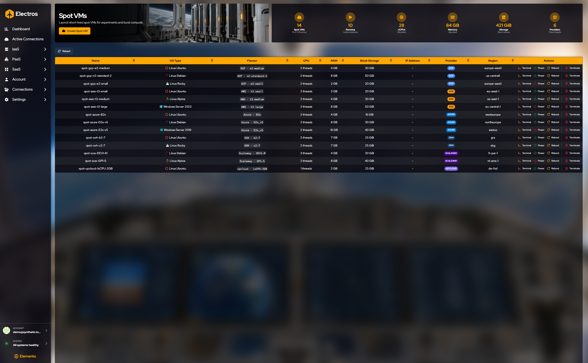
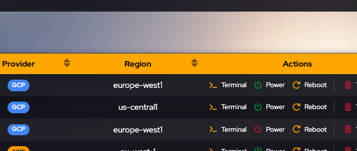
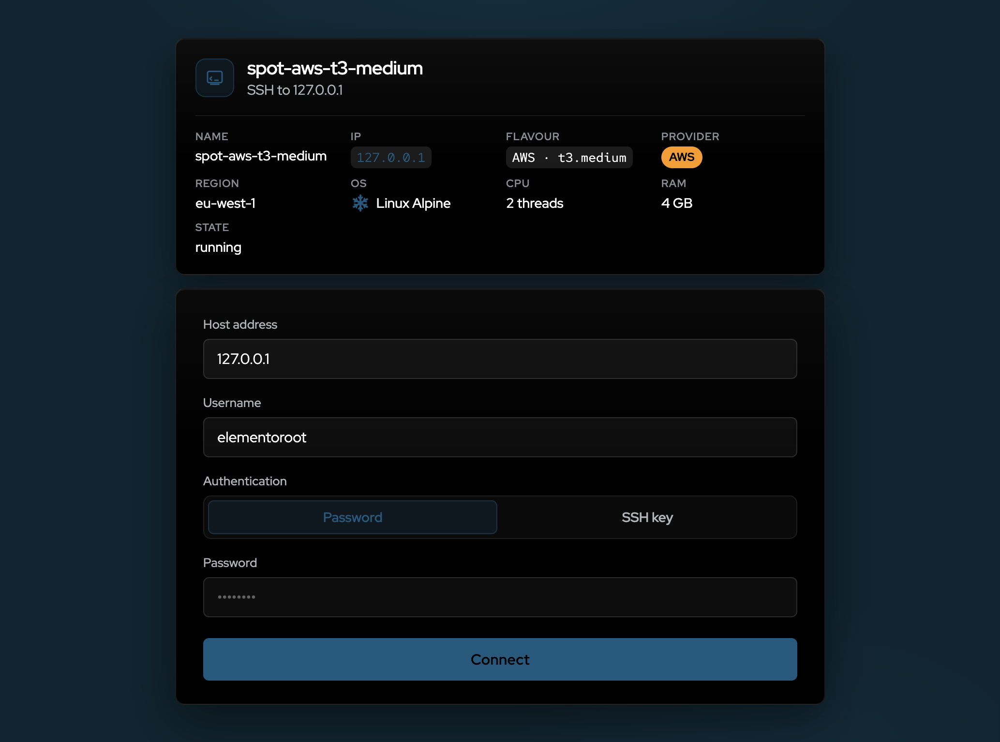
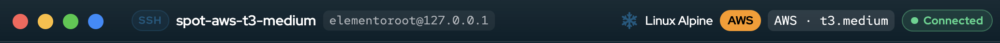
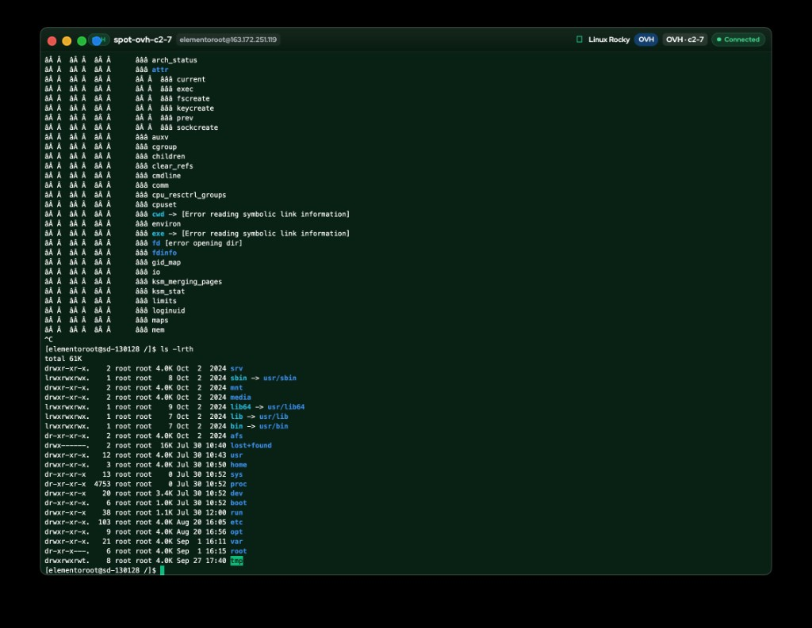
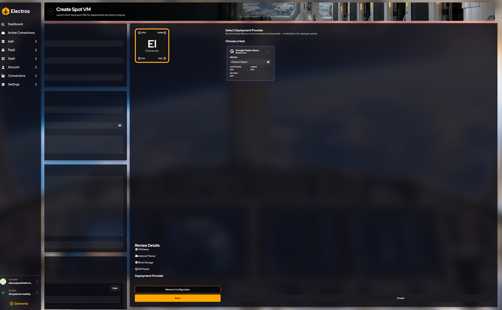
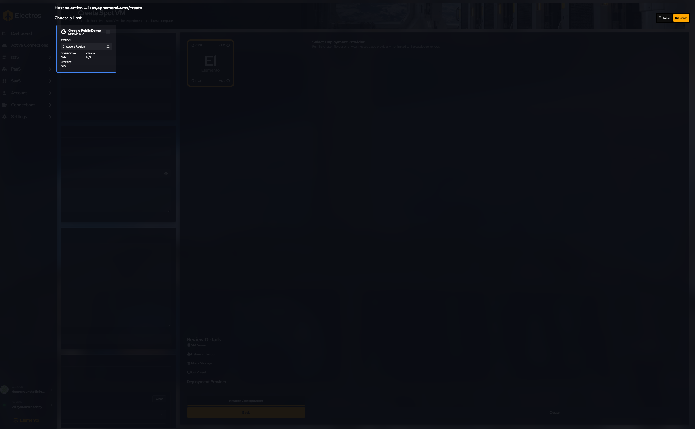

# Spot VMs

Les Spot VMs (VM éphémères) sont des machines à durée de vie courte sur un compte **cloud public**. Elles ne s'exécutent pas sur vos hôtes AtomOS locaux. Utilisez une machine virtuelle normale lorsque l'invité doit rester sur du matériel que vous contrôlez.

## À quoi sert cette page

Les Spot VMs sont des machines de pointe sur un cloud public. Utilisez-les pour une compilation, un test ou une courte expérience, puis terminez-les. Ce n'est pas l'endroit pour un disque dont vous aurez besoin le mois prochain. Cela appartient à Virtual Machines, sur un hôte que vous contrôlez. Laisser une spot VM en cours d'exécution, c'est ce pour quoi on facture, donc la ligne est construite autour de l'alimentation et de la terminaison plutôt que d'un long cycle de vie.

## Lire la page

La bannière indique que ce sont des machines à durée de vie courte pour les expériences et le calcul en rafale.

Les jauges comptent **Spot VMs**, **Running**, **vCPUs**, **Memory**, **Storage** et **Providers**.

Les colonnes du tableau sont **Name**, **OS Type**, **Flavour**, **CPU**, **RAM**, **Block Storage**, **IP Address**, **Provider**, **Region** et **Actions**. **Reload** actualise la liste. Un tableau vide signifie que vous n'en avez pas encore créé, pas que la page a échoué.

<figure class="zoom">
  
  <figcaption>Provider et region indiquent où l'instance a été placée. <strong>Terminal</strong> ouvre SSH vers l'IP de l'instance dans l'application de bureau. <strong>Power</strong> et <strong>Reboot</strong> la conservent. L'icône poubelle est <strong>Terminate</strong> : l'instance est supprimée et sa facturation s'arrête.</figcaption>
</figure>

| Action | Ce qu'elle fait |
|--------|----------------|
| **Terminal** | Ouvre une session SSH vers l'IP publique de l'instance dans l'application de bureau Electros. L'invité doit être en cours d'exécution et joignable sur le port 22. Saisissez le nom d'utilisateur et le mot de passe ou la clé définis à la création |
| **Power** | Démarre ou arrête l'instance |
| **Reboot** | La redémarre |
| **Terminate** | Supprime la spot VM. Elle ne continue pas à tourner, et vous arrêtez de payer pour elle. Confirmez uniquement lorsque vous comptez jeter la machine |

## SSH depuis Terminal

**Terminal** n'est disponible que dans l'**application de bureau** Electros. La version navigateur ne peut pas ouvrir la fenêtre SSH.

Les nouvelles spot VMs ouvrent **TCP 22** (et 443) sur le réseau public par défaut pour que SSH puisse atteindre l'invité. La session utilise l'**IPv4 publique** de l'instance, pas l'hôte API Meson.

### Formulaire de connexion

La fenêtre s'ouvre sur un écran de connexion avec le résumé de la VM (nom, IP, flavour, fournisseur, OS et état). L'hôte et le nom d'utilisateur sont préremplis depuis la ligne.

Choisissez comment vous authentifier :

| Méthode | Ce que vous saisissez |
|--------|----------------|
| **Password** | Le mot de passe défini lors de la création de la spot VM |
| **SSH key** | Une clé privée depuis `~/.ssh`, ou **Browse…** pour choisir un autre fichier. Phrase secrète optionnelle si la clé est chiffrée |

Appuyez sur **Connect** lorsque l'invité est en cours d'exécution et que le port 22 est joignable.

### Session connectée

Après la connexion, la barre de titre garde l'identité de l'instance visible : nom, `user@ip`, OS, fournisseur, flavour et état de connexion. Le thème du terminal suit le système d'exploitation de l'invité.

<figure class="zoom">
  
  <figcaption>La barre de titre affiche le nom de la spot VM, le point d'accès, l'OS, le fournisseur cloud, le flavour de l'instance, et le statut <strong>Connected</strong> pendant que le shell est ouvert.</figcaption>
</figure>

Si l'invité n'a pas encore d'IP publique, ou si SSH est ouvert hors de l'application de bureau, Electros affiche une erreur au lieu d'une fenêtre vide. Si l'instance est éteinte, vous pouvez ouvrir quand même ou démarrer et ouvrir.

## En créer une

**Create Spot VM** ouvre l'assistant. L'écran utilise toujours [formulaire, puis hôte](./01-getting-started#comment-fonctionne-la-creation), mais la liste d'hôtes ne contient que des comptes cloud.

### 1. Nom et système d'exploitation

- **Name** — obligatoire. Dé ou saisie.
- **OS family, flavour, and version** — tous obligatoires. C'est l'image que le cloud démarrera.

### 2. Comment vous vous connecterez

- **Username** — obligatoire.
- **Password** — optionnel, et un secret. Préférez une clé SSH lorsque c'est possible.
- **SSH public key** — collez uniquement la clé publique, jamais la clé privée.

Une fois l'instance en cours d'exécution, **Terminal** sur la liste Spot VMs ouvre une fenêtre SSH vers l'IP publique (application de bureau). Les nouvelles spot VMs exposent **TCP 22** par défaut pour ce chemin. Voir [SSH depuis Terminal](#ssh-depuis-terminal).

### 3. Cloud-init (optionnel)

La grande zone de texte est le user-data pour le premier démarrage. **Upload file** ouvre le sélecteur de fichiers de votre ordinateur. Sautez les deux si l'image n'a pas besoin de cloud-init.

### 4. Choisir une taille (flavour)

Le catalogue est regroupé en onglets (par exemple une liste de style EC2). Vous devez sélectionner une carte de flavour avant la création.

Affinez la liste si elle est longue :

| Contrôle | Ce qu'il fait |
|---------|----------------|
| Search | Correspond aux noms de flavour |
| Workload | All, burstable, general, compute, memory, development ou cost |
| Sort | Name, vCPU, RAM ou disk, dans les deux sens |
| vCPU / RAM / disk min et max | Masque les flavours hors de la plage |
| Clear filters | Réinitialise les filtres, pas le formulaire |

### 5. Lire la revue

Vérifiez **VM name**, **instance flavour**, **block storage**, **OS preset** et **deployment provider**. Si la ligne flavour est vide, vous n'avez pas encore sélectionné de taille.

### 6. Choisir un hôte cloud

Appuyez sur **Continue**.

Seules les cibles cloud apparaissent. Sélectionnez-en une. **Create** peut ouvrir une page de paiement — ne terminez pas le paiement sauf si vous acceptez d'être facturé.

**Create** à la fin peut ouvrir une page de paiement. Ne terminez pas le paiement sauf si vous comptez être facturé. Lorsque l'instance n'est plus nécessaire, supprimez-la de cette liste pour qu'elle ne continue pas à tourner.
