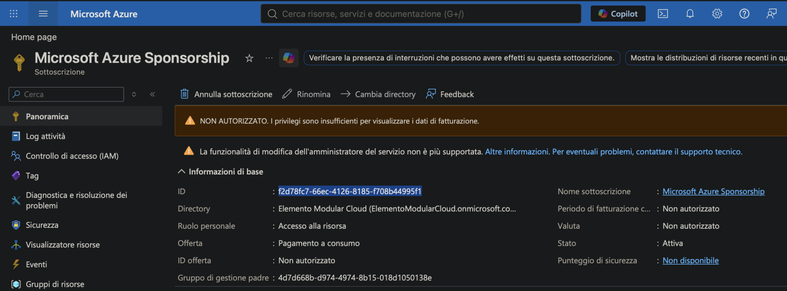
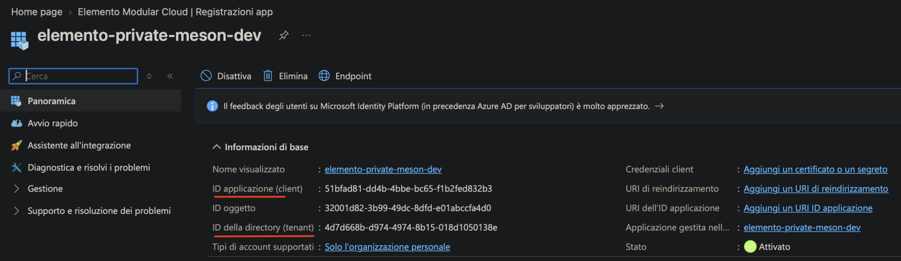
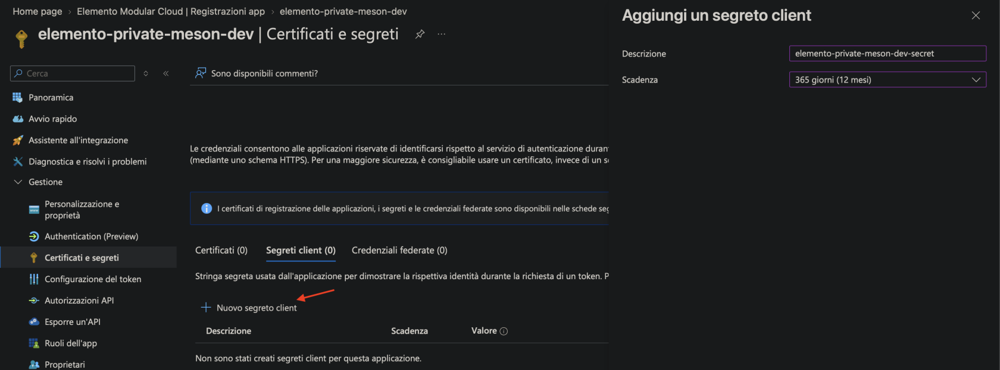

# Azure (Meson privé)

Enregistrez une application Entra ID et accordez-lui des droits sur votre abonnement ou groupe de ressources. Identifiant fournisseur : **`azure`**.

## 1. Noter le Subscription ID

Recherche → ouvrez l’abonnement cible → copiez **Subscription ID** depuis Overview → `AZURE_SUBSCRIPTION_ID`.

## 2. Créer l’App Registration

Recherche → **Microsoft Entra ID** → **App registrations** → **+ New registration**.

- **Name :** quelque chose de reconnaissable, par exemple `elemento-meson-<client>`
- **Supported account types :** Accounts in this organizational directory only (single tenant)
- **Redirect URI :** laissez vide
- Cliquez sur **Register**

Dans Overview, copiez :

- **Application (client) ID** → `AZURE_CLIENT_ID`
- **Directory (tenant) ID** → `AZURE_TENANT_ID`

## 3. Créer un secret client

App Registration → **Certificates & secrets** → **Client secrets** → **+ New client secret**.

- Définissez une description et une expiration (Azure limite à 24 mois — posez un rappel pour la rotation).
- Cliquez sur **Add**.
- Copiez immédiatement la colonne **Value** (pas Secret ID). Azure ne l’affiche qu’une fois. → `AZURE_CLIENT_SECRET`

## 4. (Recommandé) Créer un groupe de ressources

Recherche → **Resource groups** → **+ Create**. Choisissez l’abonnement et une région, donnez-lui un nom (par exemple `elemento-byoc-<client>`). Optionnel — si vous sautez cette étape, le meson en crée un nommé d’après l’organisation — mais le créer à l’avance permet de restreindre l’attribution de rôle. → `AZURE_RESOURCE_GROUP_NAME`

## 5. Accorder à l’application le droit de gérer les ressources

Sans cette étape, l’authentification réussit mais chaque appel API échoue avec **403**.

1. Ouvrez ce **groupe de ressources** (ou l’abonnement, si l’application doit gérer plusieurs RG).
2. **Access control (IAM)** → **+ Add** → **Add role assignment**.
3. Rôles : **Contributor** et **Storage Blob Data Contributor**.
4. **Members** → **+ Select members** → recherchez l’App Registration par le nom de l’étape 2 (elle n’apparaît pas sous Users) → **Select**.
5. **Review + assign**.

## Terminer dans Electros

1. **Connections** → **Add Provider** → **Private** → **Azure**.
2. Saisissez l’abonnement, le tenant, le client id, le secret client et le groupe de ressources optionnel.
3. **Conclude**, puis activez la cible dans **Active Connections**.
