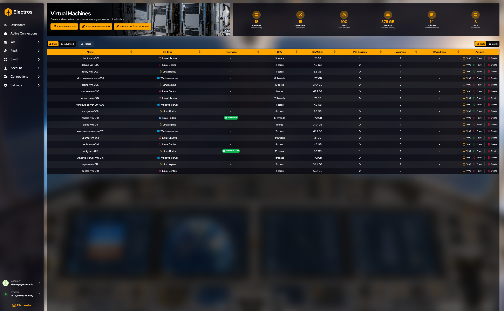
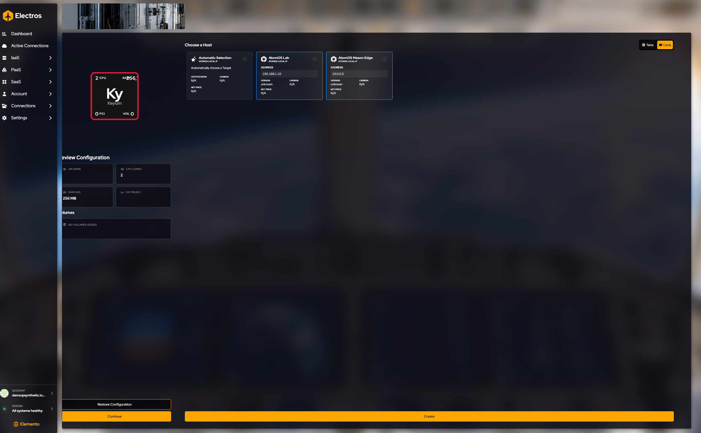
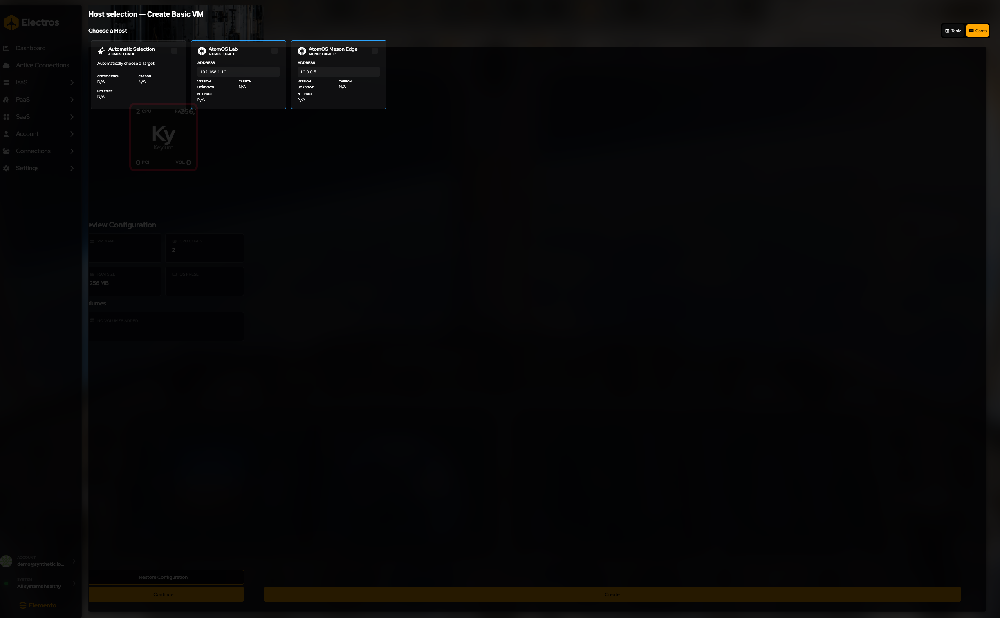
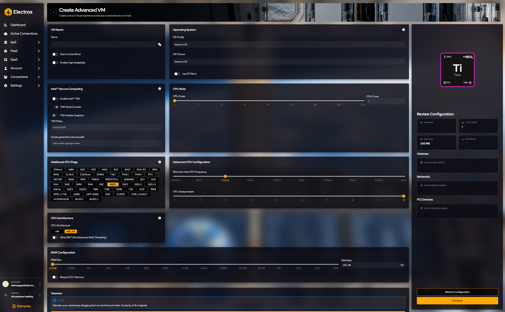
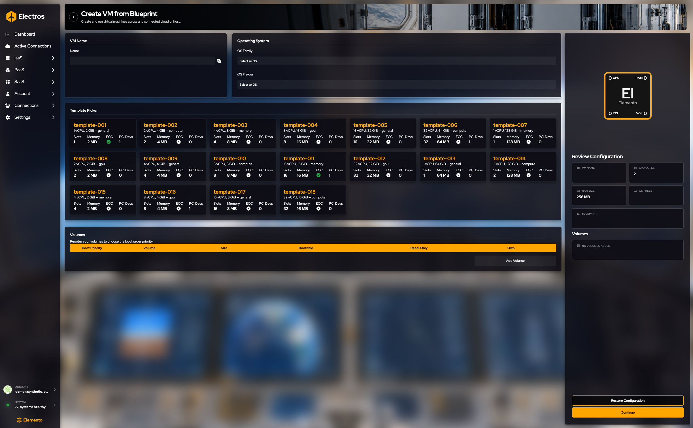
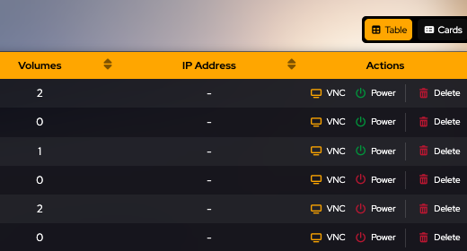

# Virtual machines

Questo è l’elenco delle VM di lunga durata e dei template da cui puoi stamparne di nuove.

## A cosa serve questa pagina

Questo è l’inventario degli ospiti che intendi tenere: macchine di laboratorio, server, template da cui stampare. Power, console, dischi ed eliminazione partono tutti dalla riga. Creare un nuovo ospite parte dai tre pulsanti sotto il titolo; i passaggi sono in [Crea una VM](#crea-una-vm) sotto.

## Leggi la pagina

I gauge contano **Total VMs**, **Blueprints**, **Slots**, **Memory**, **Volumes** e **GPUs**.

Le colonne della tabella sono **Name**, **OS Type**, **Hypervisor**, **CPU**, **RAM Size**, **PCI Devices**, **Volumes**, **IP Address** e **Actions**. Un chip verde in Hypervisor è il tipo di host (Proxmox, ESXi e così via). Un trattino significa che Electros non ha un’etichetta hypervisor per quella riga.

**Table** è l’elenco compatto. **Advanced** apre la riga in card. **Reload** aggiorna lo stato di alimentazione dagli host. **Table** e **Cards** a destra cambiano il layout.

## Crea una VM

| Pulsante | Quando usarlo |
|----------|---------------|
| **Create Basic VM** | Nome, preset OS, CPU, memoria, dischi opzionali |
| **Create Advanced VM** | Ti servono anche reti, PCI, HA, EFI o flag CPU |
| **Create VM from Blueprint** | La tua organizzazione ha già definito le dimensioni |

Il preset OS non installa l’ospite. Collega un volume o un ISO bootable se la macchina ha ancora bisogno di un installer. Tutti e tre seguono il [pattern di creazione condiviso](./01-getting-started#come-funziona-la-creazione).

### VM di base

**Dove:** Virtual Machines → **Create Basic VM**

### 1. Dai un nome alla macchina

Digita un nome, oppure premi i dadi per generarne uno. Non puoi continuare con il nome lasciato vuoto.

<figure class="zoom">
  
  <figcaption>Il nome è obbligatorio. I dadi sono opzionali e riempiono solo il campo — non creano la VM.</figcaption>
</figure>

### 2. Scegli un preset di sistema operativo

Scegli una **OS Family** (ad esempio Linux), poi un **OS Flavour** (ad esempio Ubuntu). Entrambi sono obbligatori. “Select an OS” è lo stato vuoto, non una scelta valida.

### 3. Imposta CPU e memoria

Trascina gli slider o digita un numero. Le nuove VM partono da **2 CPU cores** e **256 MB** di RAM. I core possono arrivare a 256; la memoria fino a 8 TB. Il numero a destra di ogni slider è il valore che verrà salvato.

<figure>
  
  <figcaption>Sinistra: core, default 2. A destra di ogni riga: il valore esatto. La memoria parte da 256 MB.</figcaption>
</figure>

### 4. Collega i dischi (opzionale)

La tabella dei volumi parte vuota. **Add Volume** ti consente di scegliere dischi che esistono già sull’host che sceglierai. Trascina le righe per impostare l’ordine di avvio: la cima dell’elenco avvia per prima. Una nota breve sul modulo dice che la priorità 0 è la più alta.

Se non hai ancora creato un volume, termina questo wizard senza dischi, oppure crea prima il volume sotto [Storage](./05-iaas-storage) e torna qui.

### 5. Controlla il review

Il pannello a destra deve corrispondere a ciò che intendi: nome, **2** core a meno che tu non li abbia cambiati, **256 MB** a meno che tu non li abbia cambiati, il preset OS e l’elenco dei volumi. Le tile vuote significano che quella parte è ancora non impostata.

<figure class="zoom">
  
  <figcaption>Leggilo prima di Continue. “No volumes added” è normale se hai saltato i dischi.</figcaption>
</figure>

### 6. Continue, poi scegli un host

**Restore Configuration** scarta le tue modifiche. **Continue** non crea nulla — apre la selezione host.

<figure class="zoom">
  
  <figcaption>Premi il pulsante arancione <strong>Continue</strong>.</figcaption>
</figure>

<figure class="zoom">
  
  <figcaption>Resta su <strong>Cards</strong> a meno che tu non preferisca una tabella.</figcaption>
</figure>

- **Automatic Selection** — Electros sceglie un host idoneo.
- Una card nominata — scegli tu il laboratorio, l’edge box o l’account cloud.

La card selezionata diventa arancione. Fermati qui se stai solo imparando la schermata. **Create** è ciò che avvia davvero la VM.

I dettagli di login (username, password, chiave SSH) compaiono solo quando la modalità Experimental è attiva. Non mettere una chiave privata in uno screenshot condiviso; una chiave pubblica basta per l’ospite.

La creazione basic richiede sempre una macchina **x86_64**.

---

### VM advanced

**Dove:** Virtual Machines → **Create Advanced VM**

Inizia come una VM di base: nome, OS, CPU, memoria, volumi, review, host. Le sezioni extra sono opzionali. Lasciale stare a meno che non ti servano.

| Sezione | Cosa impostare | Lasciala stare quando |
|---------|----------------|------------------------|
| Start on host boot | Attiva se la VM deve avviarsi ogni volta che l’host si avvia | La avvierai tu |
| High availability | Abilita HA, poi imposta una priorità da 0 a 100 | Non ti serve il failover |
| EFI boot | On per gli ospiti che richiedono UEFI. Alcuni flavour OS lo bloccano per te | Il preset corrisponde già all’ospite |
| Intel TDX | VM confidenziale. Console seriale, grafica, policy e il path quote-socket restano disabilitati finché TDX non è on | Non stai usando hardware TDX |
| CPU flags | Funzionalità CPU extra. SSE2 parte selezionato. La frequenza minima di default è **1.5 GHz**. L’overprovisioning di default è **10** | La CPU di default dell’host va bene |
| Architecture | Scegli l’architettura CPU di cui l’ospite ha bisogno | x86_64 è già corretto |
| SMT | Consenti il simultaneous multithreading | Vuoi un thread per core |
| ECC memory | Richiedi RAM con correzione degli errori. Alcuni preset OS lo bloccano | Qualsiasi memoria è accettabile |
| Networks | **Add Network**, poi scegli la rete, il driver (auto se non sei sicuro), MAC (vuoto = auto) e i tag VLAN se li usi | La VM non ha ancora bisogno di una NIC |
| PCI | **Add PCI Device** con vendor, device e quantità. “Attach full PCI lane” è un interruttore separato | Non stai facendo pass-through di hardware |

Poi **Continue**, scegli un host e fermati prima di **Create** — come nel wizard di base.

---

### VM da un blueprint

**Dove:** Virtual Machines → **Create VM from Blueprint**

1. Dai un nome alla VM.
2. Scegli famiglia e flavour OS.
3. Seleziona una **template card**. Ogni card mostra quanti slot CPU, quanta memoria e se è richiesto ECC. Devi sceglierne una.
4. Opzionalmente aggiungi volumi.
5. Leggi il review (nome, CPU, memoria, OS, blueprint, volumi).
6. **Continue**, scegli un host, fermati prima di **Create**.

Usalo quando la tua organizzazione ha già concordato le dimensioni (“small”, “gpu” e così via) e non vuoi impostare core e RAM a mano.

---

### Modifica una VM esistente

Aprire la modifica da una VM mostra attualmente un breve avviso di live-update. Il modulo non è ancora finito, quindi non c’è nulla da compilare. Modifica CPU, dischi e reti dalle azioni di riga della VM nell’elenco.

## Sulla riga

<figure class="zoom">
  
  <figcaption>Ogni riga termina allo stesso modo. <strong>VNC</strong> apre la console grafica. <strong>Power</strong> avvia o ferma l’ospite. <strong>Delete</strong> ti chiede di digitare il nome. <strong>Table</strong> e <strong>Cards</strong> cambiano solo il layout.</figcaption>
</figure>

| Pulsante | Cosa fa |
|----------|---------|
| **VNC** | Apre la console grafica. L’ospite deve essere in esecuzione |
| **Power** | Avvia una VM fermata o spegne una in esecuzione. Stopped non è eliminata |
| **Delete** | Ti chiede di digitare il nome della VM. Annulla per tenerla |

## Quando espandi una riga

Passa a **Advanced**, oppure apri la riga, per le card di dettaglio.

**VM Details** mostra nome, UUID, host, sistema operativo, stato, uptime, data di creazione e se l’high availability è attiva. Da lì:

| Pulsante | Quando lo vedi | Cosa fa |
|----------|----------------|---------|
| **Boot** o **Shut Down** | Sempre | Cambio di alimentazione pulito |
| **Reboot** | Sempre | Riavvia l’ospite |
| **Force Off** | Sempre | Taglia l’alimentazione. Usalo quando Shut Down non torna |
| **Migrate** | La VM è su AtomOS | La sposta su un altro host |
| **Backups** | La VM è su AtomOS | Elenca, crea o elimina un backup |
| **Attach QEMU Agent** | L’agent ospite manca | Collega l’agent così Electros può leggere i dettagli dell’ospite |
| **Clone to AtomOS** | La VM non è su AtomOS | La copia su un host AtomOS |

**Remote Viewer** incorpora la console VNC nella riga.

**Attached Resources** elenca volumi, dispositivi PCI e reti. Su un host AtomOS hai anche port forwarding e port tunnel, ciascuno con un pulsante più per collegarne un altro. Una VM che non è su AtomOS non offre quelle azioni sulle porte.
