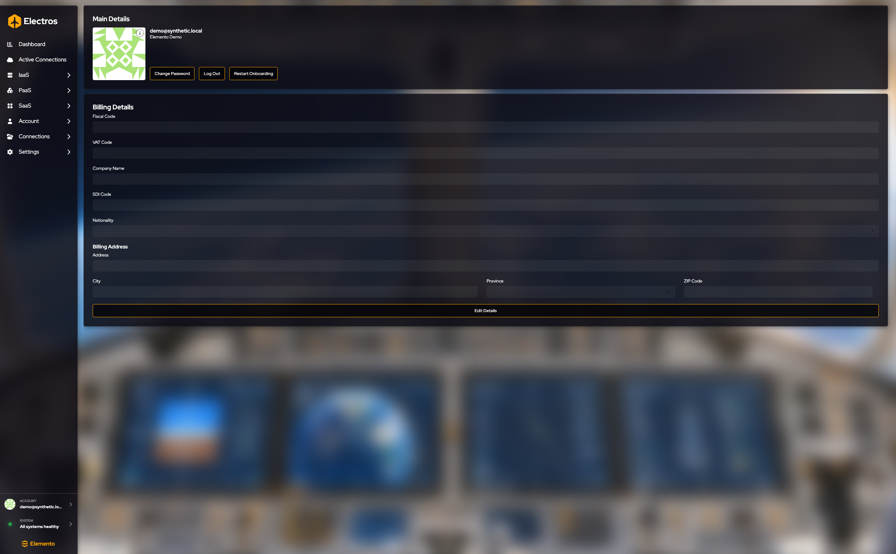
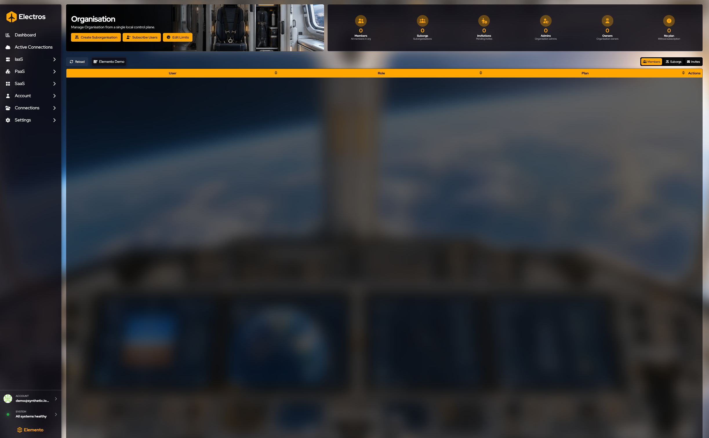
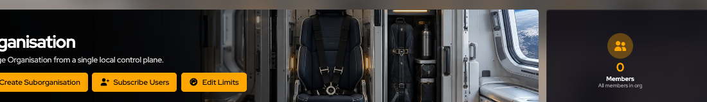
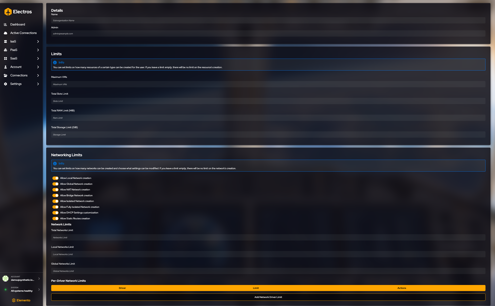
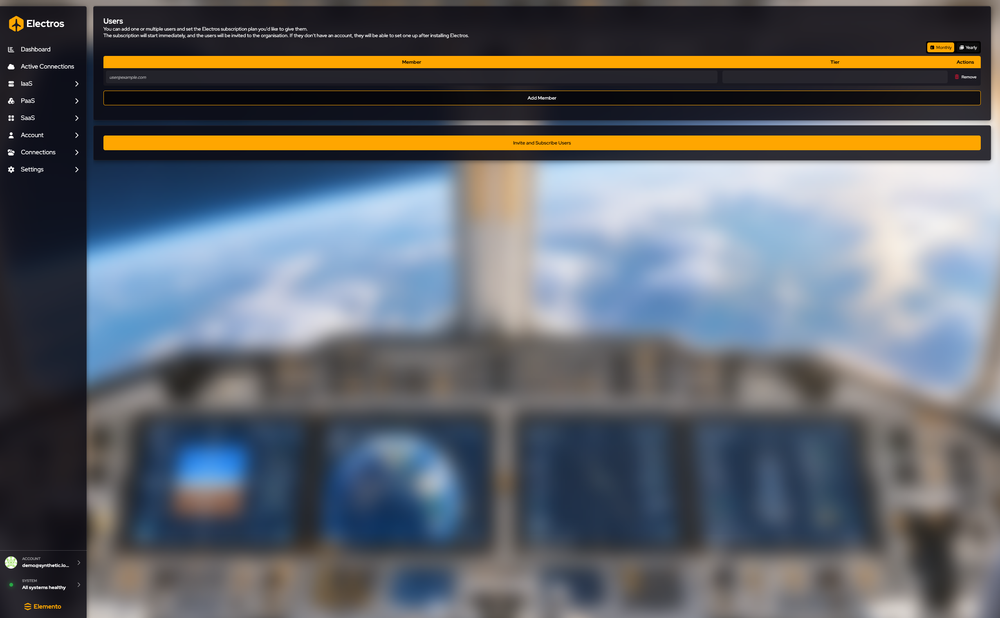
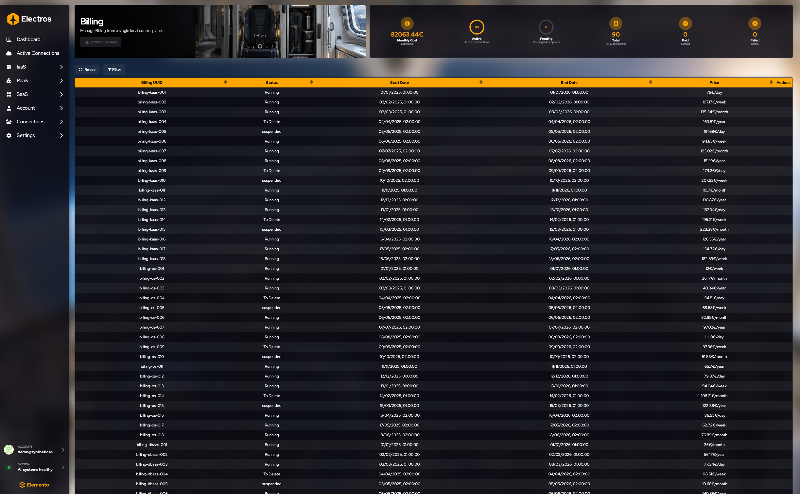

# Account

Account riguarda te e l’organizzazione, non le VM. Aprilo dalla barra laterale.

## Il tuo profilo

**Main details** mostra la tua email, l’organizzazione in cui ti trovi e il tuo Gravatar. Cambia l’immagine su Gravatar, non in Electros. L’icona info sull’avatar dice la stessa cosa.

| Pulsante | Cosa fa |
|----------|---------|
| **Change Password** | Apre la pagina password del portale Elemento in un browser. Electros non raccoglie da solo la nuova password |
| **Log Out** | Termina questa sessione. Vedrai la schermata di login |
| **Restart Onboarding** | Riproduce di nuovo il tour introduttivo |

**Billing details** elenca codice fiscale, partita IVA, ragione sociale, codice SDI, nazionalità e l’indirizzo di fatturazione (indirizzo, città, provincia, CAP). Le caselle partono bloccate.

1. Premi **Edit Details**. I campi diventano modificabili e compaiono **Revert Changes** e **Save Details**.
2. Modifica ciò che ti serve.
3. **Save Details** li scrive. **Revert Changes** ripristina i valori precedenti e blocca di nuovo il modulo.

## Preferenze email

La voce nella barra laterale c’è. Nella build attuale il titolo della pagina è **Email prefs todo** e la canvas è vuota. Non c’è ancora nulla da salvare. Non cambia chi può accedere.

## Organisation

<figure class="zoom">
  
  <figcaption>La pagina organisation è come un admin fa crescere il tenant. <strong>Create Suborganisation</strong> suddivide le quote. <strong>Subscribe Users</strong> invita persone su un piano a pagamento. <strong>Edit Limits</strong> modifica i tetti. Il gauge Members è chi è già nell’org.</figcaption>
</figure>

Visibile quando puoi gestire l’organizzazione.

I gauge contano **Members**, **Suborgs**, **Invitations**, **Admins**, **Owners** e **Nodes**.

I pulsanti sotto il titolo sono **Create Suborganization**, **Subscribe Users** e **Edit Limits**. La striscia a destra passa la tabella tra **Members**, **Suborgs** e **Invites**. Le colonne della tabella membri sono **User**, **Role**, **Plan** e **Actions**.

| Voglio… | Dove |
|---------|------|
| Dare a un team le proprie quote | **Create Suborganization**. Passaggi sotto [Crea una sotto-organizzazione](#crea-una-sotto-organizzazione) |
| Invitare qualcuno e metterlo su un piano a pagamento | **Subscribe Users**. Passaggi sotto [Invita persone e abbonale](#invita-persone-e-abbonale). Apre una payment page |
| Aggiungere un membro esistente a una sotto-organizzazione | Apri la sotto-organizzazione, poi [Aggiungi persone già presenti nell’organizzazione](#aggiungi-persone-gia-presenti-nellorganizzazione) |
| Cambiare i tetti di CPU, RAM o rete | **Edit Limits**. I numeri vuoti significano nessun tetto extra |
| Rimuovere un membro o eliminare una sotto-organizzazione | La riga ti chiede di digitare il nome. Annulla per tenerlo |

### Crea una sotto-organizzazione

Usa una sotto-organizzazione quando un team deve avere i propri membri e le proprie quote.

1. **Name** — ciò che le persone vedranno nell’elenco organizzazione.
2. **Admin email** — la persona che amministra questa sotto-organizzazione.
3. **Limits** — lascia un numero vuoto per “nessun tetto extra”. Gli interruttori partono **on**, il che significa che quel tipo di rete è consentito.
4. Premi **Create suborganisation** solo quando nome e admin sono corretti.

Limiti che puoi impostare:

| Limite | Unità |
|--------|-------|
| Maximum VMs | conteggio |
| Total CPU slots | conteggio |
| Total RAM | MiB |
| Total storage | GiB |
| How many networks | conteggi totali, locali e globali |
| Which network types are allowed | local, global, NAT, bridge, isolated, fully isolated, DHCP changes, static routes |
| Per-driver caps | aggiungi una riga per uno specifico driver di rete |

---

### Invita persone e abbonale

1. Scegli **Monthly** o **Yearly**. Monthly è già selezionato.
2. Ogni riga è una persona: la sua **email** e un **tier**. Il tier mostra il prezzo al mese e all’anno.
3. **Add member** per un’altra riga. **Remove** elimina una riga che non vuoi.
4. **Invite and subscribe users** apre una **payment page**. Fermati prima di quel pulsante a meno che tu non intenda pagare.

---

### Aggiungi persone già presenti nell’organizzazione

Apri una sotto-organizzazione, poi **Add members**.

Puoi aggiungere solo email che appartengono già all’organizzazione padre e non sono ancora in questa sotto-organizzazione. Il campo suggerisce quelle persone mentre digiti. Questa schermata non invita qualcuno di nuovo in Electros — usa **Invite and subscribe** per quello.

## Billing

I gauge sono **Monthly Cost**, **Active**, **Pending**, **Total**, **Paid** e **Failed**.

Le colonne della tabella sono **Billing UUID**, **Status** (Running, To Delete, suspended), **Start Date**, **End Date**, **Price** e **Actions**.

| Controllo | Cosa fa |
|-----------|---------|
| **Reload** | Aggiorna l’elenco delle fatture |
| **Filter** | **Show terminated subscriptions** include i piani già terminati |
| **Print Overview** | Riservato; il pulsante è disabilitato |

Un ritorno dal checkout atterra su una breve pagina di callback. Non la compili. Se non hai mai avviato il checkout, lì non c’è nulla da vedere.

Inviti e verifica email finiscono nella casella di posta, fuori da Electros. L’app mostra il risultato solo dopo che accetti il link.
