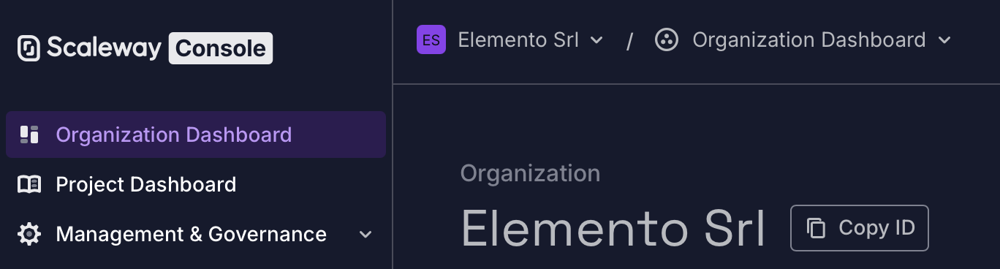
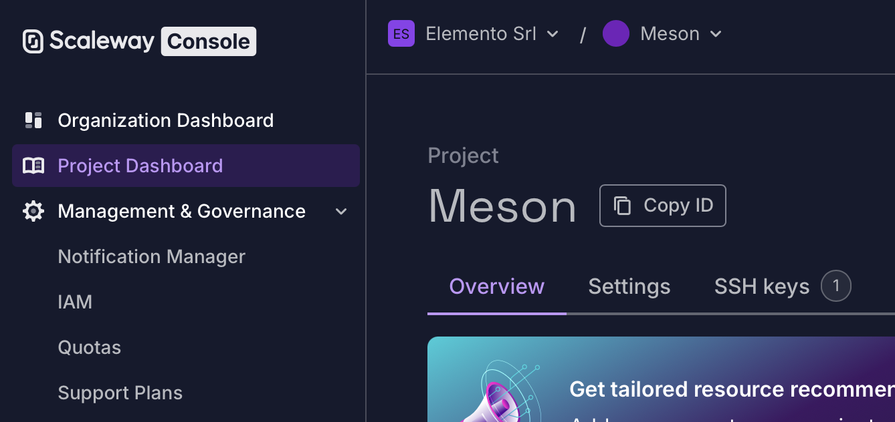
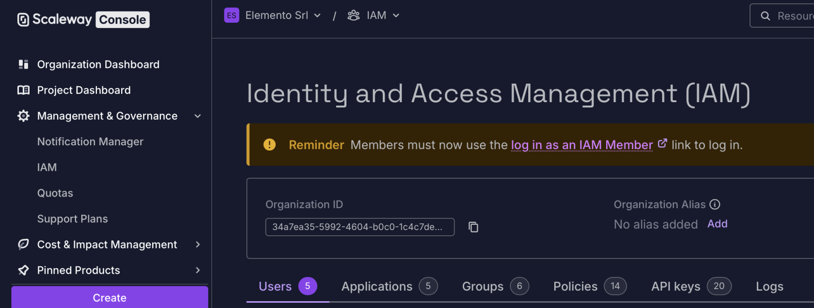
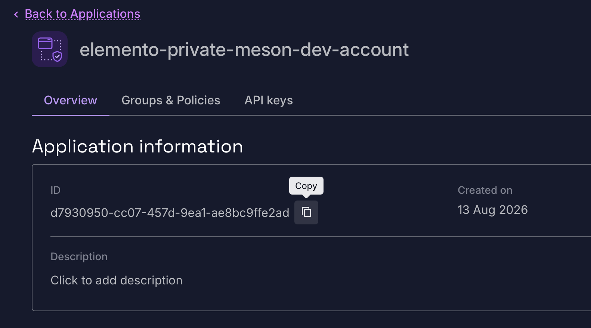
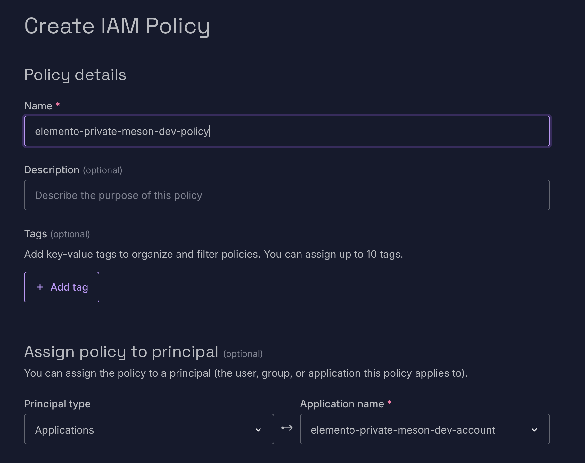
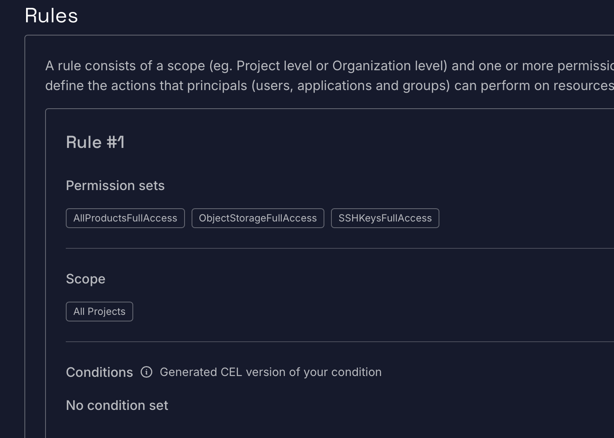
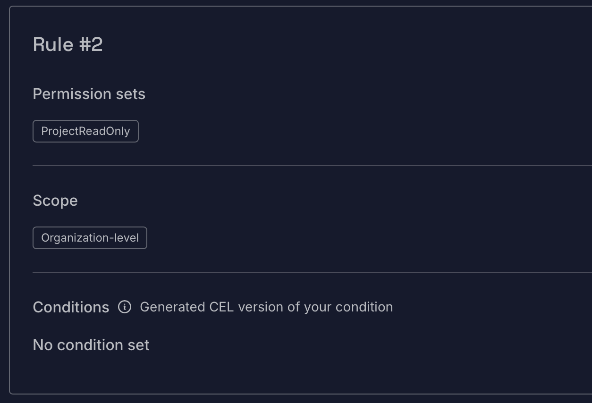
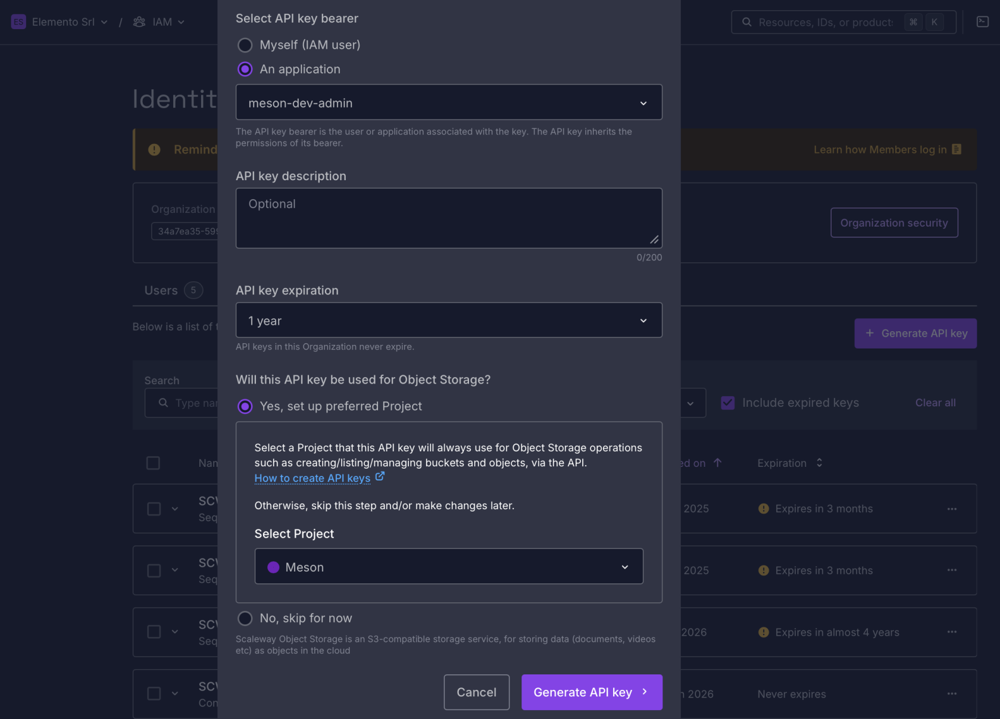

# Scaleway (Meson privato)

Raccogli organizzazione, progetto, application e chiavi API Scaleway per Electros. Id provider: **`scaleway`**.

## Cosa ti serve

| Campo | Come ottenerlo |
|-------|----------------|
| `SCALEWAY_ORGANIZATION_ID` | Organization dashboard → Copy ID |
| `SCALEWAY_PROJECT_ID` | Project dashboard → Copy ID |
| `SCALEWAY_APPLICATION_ID` | IAM → Applications |
| `SCALEWAY_API_KEY` / `SCALEWAY_SECRET_KEY` | IAM → API keys |

## Organization ID

1. Apri **Organization Dashboard** nella barra laterale sinistra.
2. Fai clic su **Copy ID** accanto al nome dell’organizzazione.

## Project ID

1. Apri **Project Dashboard**. Usa un progetto esistente o creane uno. Seleziona il progetto corretto nel menu in alto accanto al nome dell’organizzazione.
2. Fai clic su **Copy ID** accanto al nome del progetto.

## Application, policy e API keys

1. Apri **IAM** nella barra laterale sinistra.

2. Apri **Applications** e crea un’application chiamata `elemento-meson`.
3. Copia l’application id in **`SCALEWAY_APPLICATION_ID`**.

4. Apri **Policies** e crea una policy per quell’application.

5. Aggiungi le regole necessarie al Meson Elemento sul progetto, poi conferma.

6. Apri **API keys** e crea una chiave. Seleziona il progetto corretto in Object Storage.

7. Copia il **Key ID** e il **secret** quando vengono mostrati.

## Completa in Electros

1. **Connections** → **Add Provider** → **Private** → **Scaleway**.
2. Incolla organizzazione, progetto, application e chiavi API.
3. **Conclude**, poi abilita il target in **Active Connections**.
