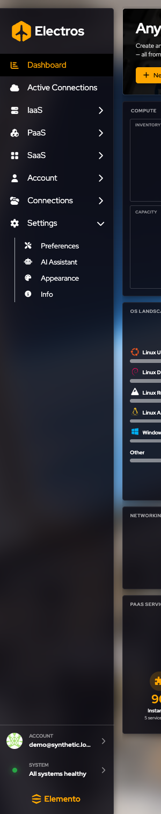
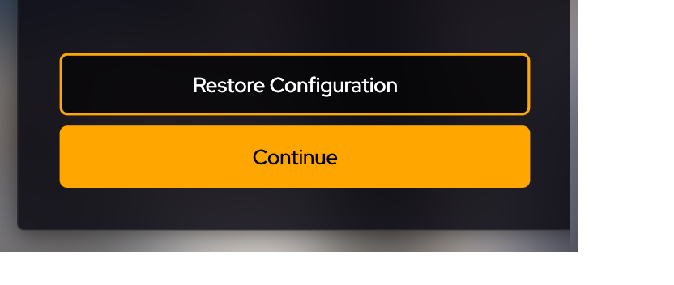
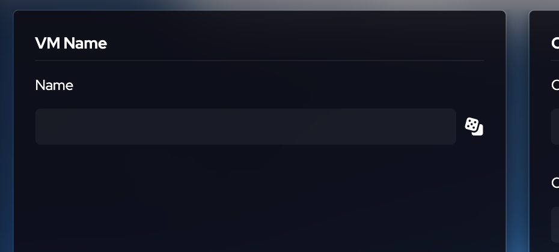
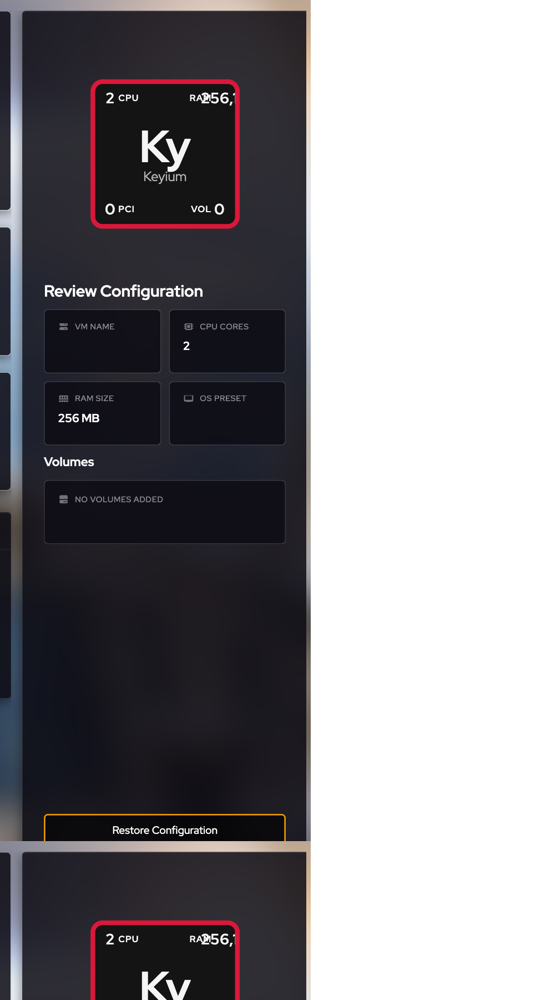
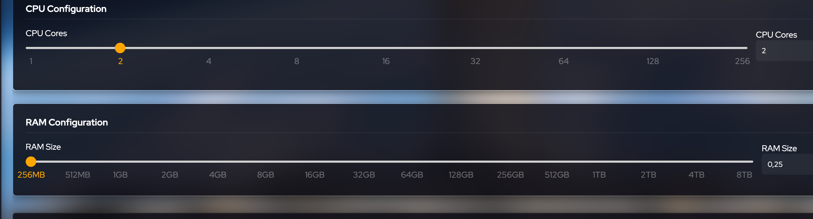

# Getting started

Electros is the screen you use to run workloads on machines you already connected: your own AtomOS hosts, hypervisors such as Proxmox or ESXi, and public clouds. You do not SSH into each box to create a disk or a VM. You describe it here, choose the host, and Electros talks to that host for you.

If you are about to create something, skim [How creation works](#how-creation-works) first. Every wizard uses the same rhythm: fill the form, press **Continue**, choose a host, then press **Create** only when you mean to provision.

<figure class="zoom">
  
  <figcaption>The sidebar is the map. The amber row is the page you are on. A chevron opens a group. The footer is the signed-in account and daemon health.</figcaption>
</figure>

## What the shell is for

Electros is a local control plane. The sidebar never creates a resource. It only moves you. The page on the right is where you read the fleet or change it. The footer is the first thing to check when a list is empty or a wizard cannot find a host: if a daemon is down, the health line turns red and the pages that depend on that daemon stay blank.

## The sidebar

The left bar is how you move. A chevron means the item opens a group. Click the group name to expand it, then click the page you want.

| Item | What you do there |
|------|-------------------|
| **Dashboard** | See the whole fleet at a glance and jump into creating a VM |
| **Active Connections** | Turn targets and scenarios on or off for this session |
| **IaaS** | Opens Storage, Networking, Virtual Machines, and Spot VMs |
| **PaaS** | Opens Managed Kubernetes, Kubernetes, Database, and Object Storage when those services are enabled |
| **SaaS** | Opens hosted apps such as n8n and OpenClaw |
| **Account** | Opens your profile, email preferences, organisation, and billing |
| **Connections** | Opens Targets and Scenarios. Visible to organisation admins |
| **Settings** | Opens Preferences, AI Assistant, Appearance, and Info |

The footer shows who is signed in and whether the local daemons are healthy. **All systems healthy** means auth, compute, storage, networking, and targets are responding. If one is not, creates and lists that depend on it will fail or stay empty — fix the daemon before you debug the form.

## How a page is laid out

Most resource pages share one layout:

- **Big buttons** along the top start a create wizard (Create volume, Create Basic VM, and so on).
- **Gauges** summarise counts and capacity.
- The **table** is the inventory. Expand a row for details and row actions.
- **Reload** fetches a fresh copy from the daemons. Use it when you changed something outside this screen.

Create wizards open on top of that page. The arrow in the page title takes you back without creating anything.

## Which organisation you are in

Members, billing, and the Connections section follow the organisation you are signed into. If you do not see Connections or Organisation, your role cannot manage the org. Switch organisation from the account area before you look for those pages.

## A sensible first path

1. Confirm the sidebar footer is healthy.
2. Open **Active Connections** and check the hosts you expect are enabled. See [Active Connections](./03-my-clouds).
3. If a host is missing, an admin adds it under [Connections](./04-connections).
4. Create a disk, a network, or a VM from IaaS. Start with [How creation works](#how-creation-works).

## How creation works

Almost every resource you add in Electros — a volume, a network, a virtual machine, a database — follows the same rhythm. Learn it once and the rest of the product feels familiar.

### The two-step screen

You do not pick the host first. You describe **what** you want, then you choose **where** it should run.

1. **Fill in the form** on the left. A **Review** panel on the right updates as you type, so you can see the draft before you commit.
2. Press **Continue**. The screen slides to **Choose a Host**.
3. Pick a host card (or **Automatic Selection** when it is offered).
4. Press **Create** only when you are ready to provision. These guides stop before that button.

<figure class="zoom">
  
  <figcaption><strong>Continue</strong> moves you to host selection. <strong>Restore Configuration</strong> clears the form back to defaults.</figcaption>
</figure>

<figure class="zoom">
  
  <figcaption>On the host step, switch between <strong>Cards</strong> and <strong>Table</strong>. Cards is the default and is easier when you are comparing a handful of targets.</figcaption>
</figure>

### What a host card tells you

Each card is one place Electros can run the resource: an AtomOS machine on your network, a hypervisor, or a public-cloud account (Meson).

| On the card | What it means for you |
|-------------|------------------------|
| Name and type | Which target you are about to use, for example “AtomOS Lab” or a cloud provider |
| Address | IP of a local host, or the cloud provider name |
| Version | Electros/AtomOS version, when the host reports one |
| Net price | Estimated cost, when the provider can quote one |
| Orange highlight | The card you have selected |

**Automatic Selection** lets Electros pick an eligible host for you. Use it when you do not care which machine runs the workload. Pick a specific card when you need a particular lab, site, or cloud account.

If you are signed in as a **local user** on a single AtomOS box, Electros skips host selection and **Continue** becomes **Create**.

### Names

Most name fields have a dice button beside them. Click it to fill a random, valid name so you can move on quickly. You can always type your own.

<figure class="zoom">
  
  <figcaption>The dice fills a name for you. The field stays empty until you type or roll one — and an empty name is rejected.</figcaption>
</figure>

### Review panel

The panel on the right is a live summary, not a second form. If a value looks wrong there, fix it on the left before you continue. Empty boxes mean you have not chosen that option yet (for example no operating-system preset, or no volumes).

<figure class="zoom">
  
  <figcaption>Review shows the draft: name, CPU, memory, OS preset, and attached disks. The badge at the top is a compact picture of the same numbers.</figcaption>
</figure>

### Sliders

CPU, memory, and disk size use a slider **and** a number. Drag the slider for a preset size, or type an exact value when the screen offers a custom mode. The mark under the handle is the size that will be created.

<figure>
  
  <figcaption>CPU defaults to <strong>2 cores</strong>. Memory defaults to <strong>256 MB</strong>. Move the handle or edit the number on the right.</figcaption>
</figure>

### Before you press Create

- **Create** allocates the resource on the host you chose. These guides never ask you to press it.
- Some cloud and organisation flows open a **payment page** after a successful create. Finish that only if you intend to be charged.
- Leave passwords, API keys, and private SSH keys out of screenshots and shared notes.
- If a host shows **Update Required**, the target is reachable but too old for that action. Update the host, or pick another one.

### Where to go next

| I want to… | Open |
|------------|------|
| Register a machine, cloud, or hypervisor | [Connections](./04-connections) |
| Add a disk, cloud image, or cloud-init volume | [Storage](./05-iaas-storage) |
| Add a local or Tailscale network | [Networking](./06-iaas-networking) |
| Create a virtual machine | [Virtual machines](./07-iaas-virtual-machines) |
| Create a short-lived cloud VM | [Spot VMs](./08-iaas-ephemeral-vms) |
| Deploy Kubernetes, a database, or an app | [PaaS and SaaS](./09-paas-saas) |
| Create a sub-organisation or invite people | [Account](./10-account) |