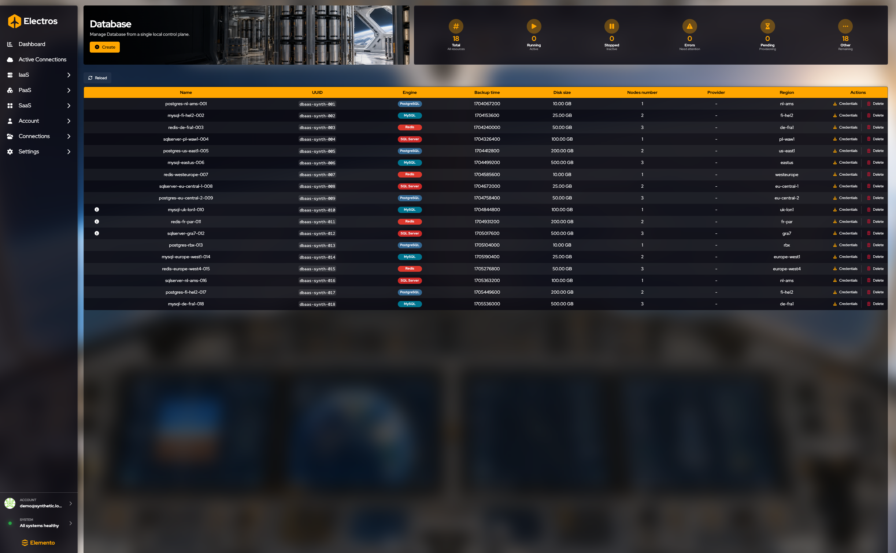
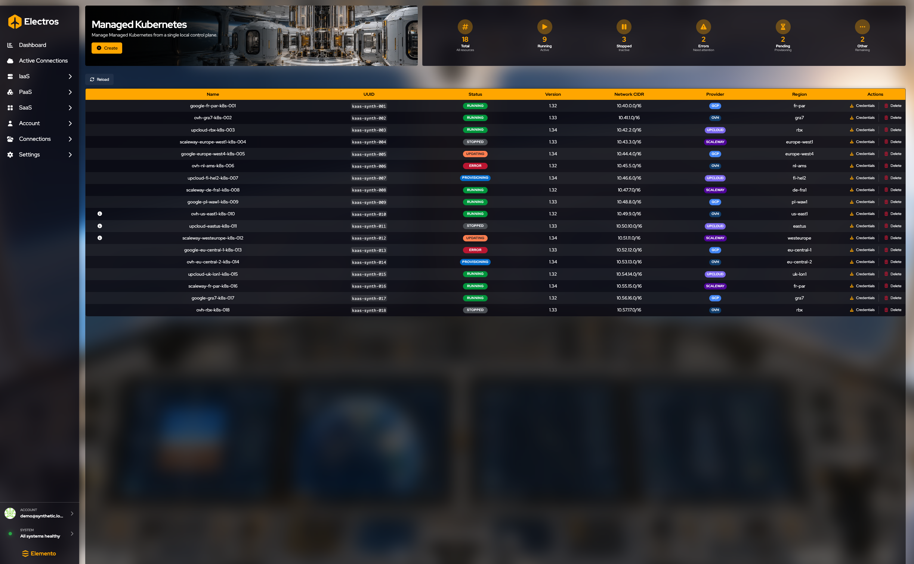
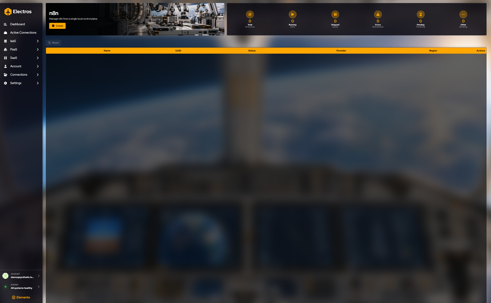
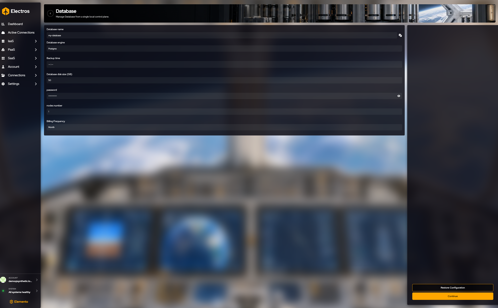
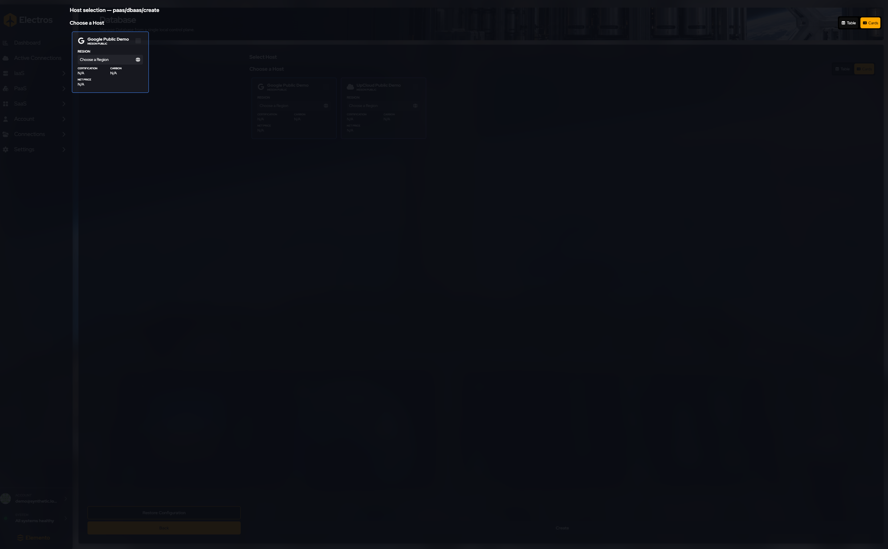
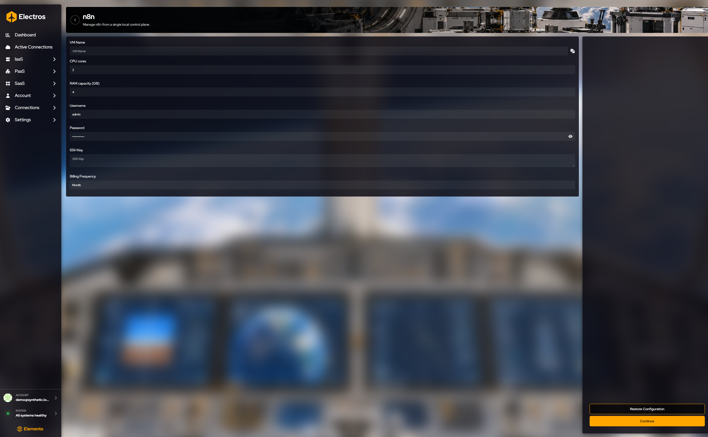

# PaaS and SaaS

These pages are managed services, not virtual machines you assemble yourself. The sidebar fills them from the services your organisation is allowed to deploy. In a typical install you will see:

| Sidebar | You are looking at |
|---------|-------------------|
| PaaS → Managed Kubernetes | A hosted Kubernetes control plane |
| PaaS → Kubernetes | Kubernetes where you supply the state bucket |
| PaaS → Database | Redis, MySQL, SQL Server, or Postgres |
| PaaS → Object Storage | Buckets |
| SaaS → n8n | An n8n app VM |
| SaaS → OpenClaw | An OpenClaw app VM |

You come here after the service exists. Create is how you order one. The table is how you see whether it is running, where it was placed, and how you get in. **Credentials** is the important row action on databases and Kubernetes: it is the password or kubeconfig, and it is a secret. **Delete** removes the instance. Confirm only when you mean to.

## What every service page has in common

Every one of these pages shares the same chrome:

- A **Create** button under the title. It opens a form, then a host picker. Region and price come from the host you select.
- Six gauges: **Total**, **Running**, **Stopped**, **Errors**, **Pending**, and **Other**.
- **Reload**.
- A table. **Delete** is always in Actions and asks you to confirm.

What changes is the columns and the extra action.

**Database.** Columns are Name, UUID, Engine (Postgres, MySQL, SQL Server, Redis), Backup time, Disk size, Nodes number, Provider, Region, and Actions. Besides Delete you get **Credentials**. That dialog shows the connection secret. Do not paste it into a ticket.

**Managed Kubernetes.** Columns are Name, UUID, Status (Planned, Provisioning, Error, and so on), Version, Network CIDR, Provider, Region, and Actions. **Credentials** is the kubeconfig-style secret for that cluster.

**n8n and OpenClaw.** Columns are Name, UUID, Status, Provider, Region, and Actions. An empty table with every gauge at zero means you have not deployed one yet.

Kubernetes (the one where you bring the state bucket) and Object Storage use this same page shape, with columns that match what you filled in at create time.

## Create one

PaaS and SaaS create screens share one flow ([How creation works](./01-getting-started#how-creation-works)). The fields change with the service; the steps do not.

1. Fill the form. Required fields are marked by the form; a password field is always a secret.
2. Press **Continue**. **Create** stays disabled until a host is selected and Electros can price the allocation.
3. Choose a host. The region comes from that host — you do not pick a region in the form.
4. Stop before **Create**. A successful create can open a **payment page**.

**Restore Configuration** asks you to confirm, then clears the form.

---

### Database

**Where:** PaaS → Database → Create

| What you set | Guidance |
|--------------|----------|
| Name | A name you will recognise in the list |
| Engine | Starts as **Postgres**. Also Redis, MySQL, or SQL Server |
| Backup time | When backups should run |
| Disk | Starts at **50 GB** |
| Password | Secret. Replace any example value before you create |
| Nodes | Starts at **1** |
| Billing | Starts at **monthly**. Also daily, weekly, or yearly |

---

### n8n and OpenClaw

**Where:** SaaS → n8n → Create (OpenClaw is the same kind of form)

You are describing a small VM that runs the app:

| What you set | Typical start |
|--------------|----------------|
| VM name | You choose |
| CPU | 2 cores for n8n, 4 for OpenClaw |
| RAM | 4 GB |
| Username | `admin` |
| Password | Secret — set your own |
| SSH key | Public key, optional |
| Billing | Monthly |

---

### Managed Kubernetes

**Where:** PaaS → Managed Kubernetes → Create

| What you set | Typical start |
|--------------|----------------|
| Cluster name | `my-cluster` until you change it |
| Node pools | Pick from the list |
| DHCP | On |
| Network range | `192.170.5.0/24` until you change it |
| Updates | Always update, or manual |
| Kubernetes version | The newest offered (for example 1.34) |
| Control-plane HA | Off until you need it |
| Billing | Monthly |

---

### Kubernetes (you bring the state store)

**Where:** PaaS → Kubernetes → Create

This variant expects an S3-compatible bucket for cluster state.

| What you set | Guidance |
|--------------|----------|
| Cluster name | You choose |
| S3 endpoint, bucket, access key | From your object store |
| Secret access key | Secret |
| Node count | Starts at **3** |
| Node and control-plane disk | Start at **64 GB** each |
| Network CIDR | The pod/service range you want |
| SSH public key | So you can reach the nodes |

---

### Object storage

**Where:** PaaS → Object Storage → Create

| What you set | Typical start |
|--------------|----------------|
| Bucket name | You choose; it must be unique for that provider |
| Size | **1 TB** |
| Billing | Monthly |

The region is whichever host you select on the next step.

**Create** at the end of those wizards can open a payment page. Passwords and cloud secret keys stay in the form only — do not copy them into notes.

If the sidebar group is empty, no service intents were loaded. That is a daemon or catalogue problem, not a missing click.
