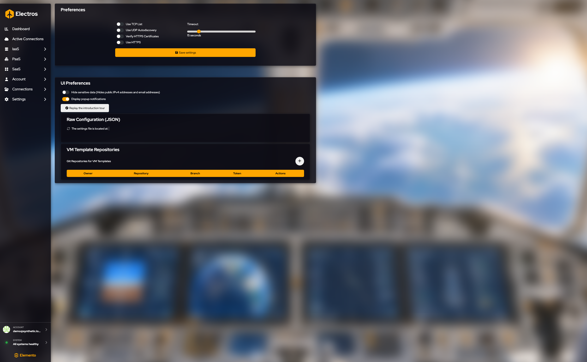
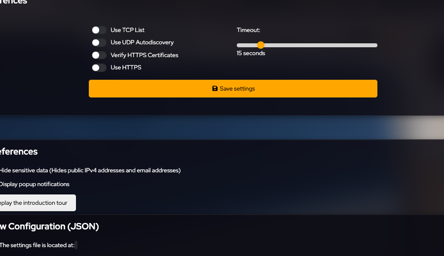
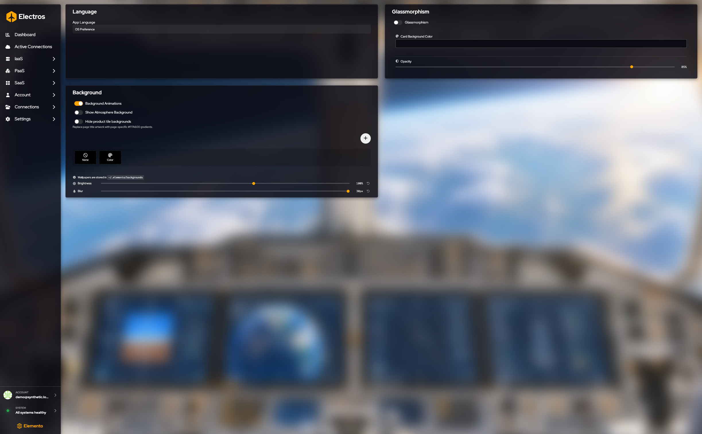
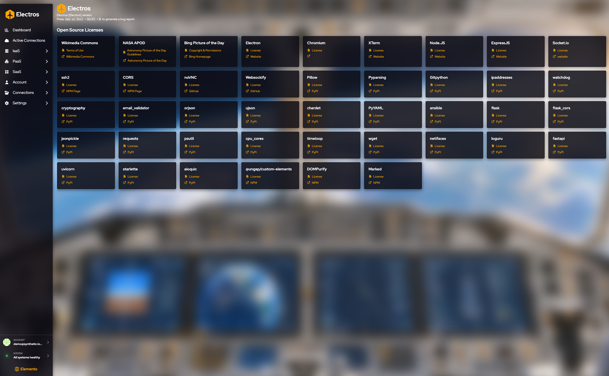

# Settings

Settings change this copy of Electros on your computer. They do not create a VM, move a disk, or change the organisation plan. Preferences is how the app finds hosts and how much of your data it shows on screen. AI Assistant is the model endpoint. Appearance is wallpaper and glass. Info is the version and the licenses.

## Preferences

<figure class="zoom">
  
  <figcaption>The four switches and the timeout are one form. Nothing is stored until you press <strong>Save settings</strong>. Fifteen seconds is the default wait. UI Preferences, below the fold, apply as you toggle them.</figcaption>
</figure>

Press **Save settings** after you change the connection block. The UI toggles apply as you set them.

### How Electros talks to hosts

| Setting | What to choose |
|---------|----------------|
| **Use TCP list** | On when targets are reached by a configured TCP list rather than discovery alone |
| **Use UDP autodiscovery** | On to find AtomOS hosts that announce themselves on the local network |
| **Verify HTTPS certificates** | Leave on unless you are debugging a lab with a private certificate you already understand |
| **Use HTTPS** | On for encrypted daemon traffic |
| **Timeout** | How long Electros waits. It starts at **15 seconds**. Raise it on a slow link; do not set it to 1 second on a WAN |

### UI Preferences

| Setting | What it does |
|---------|----------------|
| **Hide sensitive data** | Hides public IPv4 addresses and email addresses in the UI |
| **Display popup notifications** | Shows toast messages when an action succeeds or fails |
| **Replay the introduction tour** | Starts the first-run tour again |

**Raw configuration** shows the settings file Electros is using and the path on disk. Refresh rereads it. Edit the form above rather than the JSON, unless you know the file format.

### VM template repositories

Blueprints can come from a Git repository. Press **+** and fill:

| Field | Guidance |
|-------|----------|
| Owner / organisation | GitHub org or user, for example `Elemento-modular-cloud` |
| Repository name | The repo that holds the templates |
| Branch | Defaults to `master` |
| Token | Leave empty for a public repo. Required for a private one. It is a secret |

An empty table means no repo is configured yet. That is normal. **Create VM from Blueprint** only lists templates after a repo is saved and loaded.

## AI assistant

The banner is accurate: **restart Electros** after you save. **Test connection** checks the config the running app already loaded, so a test done before restart still sees the old values.

1. Pick a preset if it matches you: **Local LM Studio** or **Remote OpenRouter**.
2. Otherwise set **Base URL**, **API Key**, **Model**, and **Route Path** yourself. The API key is a secret. Placeholders show the shape: a base URL such as `https://openrouter.ai/api/v1`, a model such as `provider/model-name`, and a route such as `/chat/completions`.
3. **Save settings**.
4. Restart the app.
5. **Test connection**. The status line under **Connection** reports the result. A red message means the endpoint answered but Electros could not use the payload. Fix the URL, key, or model, save, restart, and test again.

**Advanced** is collapsed until you open it.

| Setting | Guidance |
|---------|----------|
| Request timeout (seconds) | How long to wait on the model. The placeholder is 600 |
| Persist agent sessions | Keeps chat sessions across restarts |
| Enable Headroom | Leaves extra context room for the agent |
| Headroom mode | How Headroom compresses context. The placeholder is `optimize` |
| Headroom fallback on error | Continues without Headroom if that step fails |
| Headroom store directory | Where Headroom keeps its data. The placeholder is `~/.headroom` |
| Headroom skip tools | A comma-separated list of tools Headroom should leave alone |

## Appearance

**Language.** **App Language** follows **OS Preference** unless you pick English or Italian. French, German, Spanish, and Portuguese are listed and not available yet.

**Glassmorphism.** Turn it on for frosted cards. Then set **Card Background Color**, **Opacity** (it starts near 28%), and a theme: **Light**, **Dark**, or **Midnight**. Turn it off if text is hard to read on the wallpaper.

**Background.**

| Control | What it does |
|---------|----------------|
| **Background Animations** | Motion in the wallpaper |
| **Show Atmosphere Background** | The Earth-from-orbit artwork |
| **Hide product tile backgrounds** | Replaces the photo in page titles with a flat amber gradient |
| **+** | Imports a wallpaper. The desktop app opens a file dialog. In a plain browser that action is not available |
| **None** | No wallpaper |
| **Color** | A flat colour from the picker on that tile |
| **Brightness** | Starts at 100%. The reset arrow puts it back |
| **Blur** | Starts at 0. The reset arrow clears it |

The hint under the tiles says wallpapers are stored in `~/.elemento/backgrounds`.

## Info

The header shows the Electros (Electron) version. Under **Open Source Licenses**, each card is one dependency. **License** opens that project’s license. A second link goes to the project site, npm, or PyPI. There is nothing to save.
