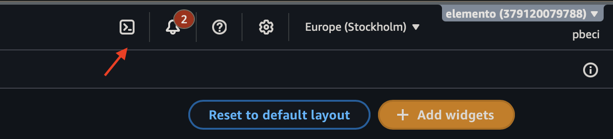

# AWS (private Meson)

Prepare an AWS account so Electros can create resources with your credentials. Provider id: **`aws`**. Expect about **30 minutes**. You need an account with administrative permissions.

## What Electros needs

| Value | Where | Required |
|-------|--------|----------|
| `AWS_ACCESS_KEY_ID` | Step 4 | Yes |
| `AWS_SECRET_ACCESS_KEY` | Step 4 | Yes |
| `AWS_SESSION_TOKEN` | Step 4, temporary credentials only | No |
| `AWS_ACCOUNT_ID` | Step 1 | Yes |
| `PROVIDER_REGION` | Step 2, your primary region | Yes |

Enter these only in Electros. Do not send them by email or chat.

## 1. Account and region

**Note the account ID**

```bash
aws sts get-caller-identity --query Account --output text
```

In the console it is in the top-right account menu.



**Regions Elemento uses**

`us-east-1`, `us-east-2`, `us-west-1`, `us-west-2`, `ca-central-1`, `eu-central-1`, `eu-central-2`, `eu-west-1`, `eu-west-2`, `eu-west-3`, `eu-south-1`, `eu-north-1`, `ap-south-1`, `ap-northeast-1`, `ap-northeast-2`, `ap-southeast-1`, `ap-southeast-2`

Virtual machines are available in a subset: `eu-central-1`, `eu-central-2`, `eu-south-1`, `us-east-1`, `ca-central-1`, `ap-northeast-1`.

**Enable opt-in regions you need**

Among those Elemento uses, `eu-central-2` (Zurich) and `eu-south-1` (Milan) may be disabled by default.

```bash
aws account get-region-opt-status --region-name eu-south-1
aws account enable-region --region-name eu-south-1
```

In the console: **Account** → **AWS Regions** → **Enable**. Activation can take up to a few hours.

## 2. Check the default VPC

Services create resources in the region's default VPC. If it is missing, creation fails with a confusing subnet error.

Check every region you intend to use:

```bash
aws ec2 describe-vpcs --filters Name=is-default,Values=true \
  --region eu-central-1 --query 'Vpcs[0].VpcId' --output text
```

If it returns `None`, recreate it:

```bash
aws ec2 create-default-vpc --region eu-central-1
```

## 3. Create the user and assign permissions

1. Console → **IAM** → **Users** → **Create user**.
2. Name: `elemento-meson`. Do **not** enable console access.
3. Console → **IAM** → **Policies** → **Create policy** → **JSON** tab.
4. Paste the content of the JSON policy files Elemento provides, **one policy per file**.
5. Return to the user → **Add permissions** → attach all the policies you created.

AWS limits each policy to 6144 characters, so there is more than one file. Which you need depends on the services you use:

| File | Needed for |
|------|------------|
| `elemento-service.json` | Object storage, database, file storage, private networking, registry, public IPs, load balancer, Kubernetes, gateway |
| `elemento-storage.json` | Block storage disks |
| `elemento-compute.json` | Virtual machines |
| `elemento-dbaasendpoint.json` | MongoDB or Redis databases with a public endpoint |

Ask your Elemento representative for the current policy JSON files if you do not already have them.

## 4. Generate credentials

**Option A — permanent keys**

User `elemento-meson` → **Security credentials** → **Create access key** → **Application running outside AWS**.

`AWS_SECRET_ACCESS_KEY` is shown only once. Save it immediately.

**Option B — temporary credentials (recommended)**

```bash
aws sts get-session-token --duration-seconds 129600
```

Temporary credentials include `AWS_SESSION_TOKEN` and last at most **36 hours**. When they expire, operations stop until you enter new ones in Electros. If you do not have a renewal process, use Option A.

## 5. Check quotas

Default limits on a new account are low. On **Service Quotas**, check (and request increases if needed) for every region you will use:

| Quota | Default | Needed if you use |
|-------|---------|-------------------|
| Elastic IPs per region | 5 | Public IPs, NAT gateway, database endpoints |
| VPCs per region | 5 | Private networks, Kubernetes |
| Network Load Balancers per region | 50 | Load balancers, public databases |
| On-demand vCPUs per region | varies | Virtual machines, Kubernetes |

## What changes in your account

The first time a virtual machine is created, Elemento enables default **EBS encryption** for that region. This is account-level: all disks created in that region are encrypted afterward, including ones not managed by Elemento.

Resources are billed by AWS directly to you. Elemento does not apply a usage cap. Use an AWS Budget with notifications if you want protection.

Every resource Elemento creates carries the `elemento:managed` tag (service name) plus a `service_uuid` tag — useful in Cost Explorer.

## Checklist

- [ ] Account ID noted
- [ ] Opt-in regions enabled and active
- [ ] Default VPC present in every region you will use
- [ ] `elemento-meson` user created, with no console access
- [ ] All necessary policies attached
- [ ] Access key generated and stored
- [ ] Quotas checked in the regions you will use

## Finish in Electros

1. **Connections** → **Add Provider** → **Private** → **AWS**.
2. Enter the values from the first table.
3. **Conclude**, then enable the target on **Active Connections**.
