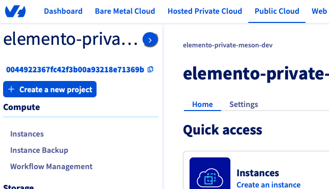
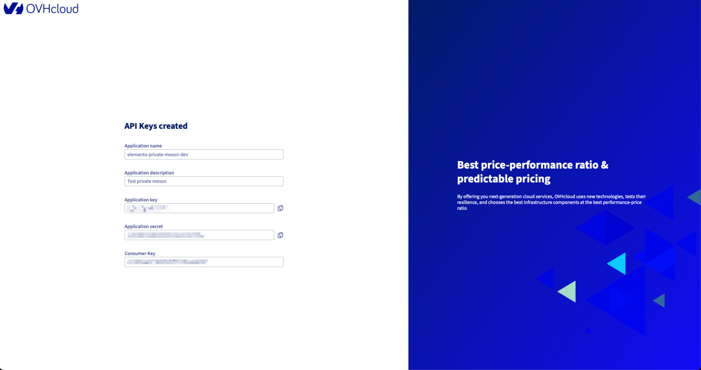

# OVH (private Meson)

Create an OVH API token set and project id for Electros. Provider id: **`ovh`**.

## Fields Electros needs

| Field | What it is |
|-------|------------|
| `OVH_APPLICATION_KEY` | Application key for the OVH account |
| `OVH_APPLICATION_SECRET` | Application secret |
| `OVH_CONSUMER_KEY` | Consumer key authorised against that account/project |
| `OVH_PROJECT` | OVH Public Cloud project ID |

## Project ID

The Public Cloud project ID (`OVH_PROJECT`) is under **Public Cloud → [project name]**. It is the ID in the URL (`/public-cloud/projects/<project-id>/…`) and in project settings — not the human-readable name.

## Application key, secret, and consumer key

1. Log into the OVH account the credentials belong to.
2. Open [https://api.ovh.com/createToken/](https://api.ovh.com/createToken/) (or `api.us.ovhcloud.com` / `api.ca.ovh.com` for other endpoints) while logged into that account.
3. Fill in:
   - **Application name:** for example `elemento-meson`
   - **Application description:** free text
   - **Validity:** unlimited unless you want the token to expire
   - **Rights:** this form also mints a consumer key, so set rights here

| Method | Path |
|--------|------|
| GET | `/cloud/project/{serviceName}/capabilities/kube/flavors` |
| GET, POST, DELETE | `/cloud/project/{serviceName}/kube` |
| GET, POST, DELETE | `/cloud/project/{serviceName}/kube/*` |
| GET, POST | `/cloud/project/{serviceName}/network/private` |
| GET | `/cloud/project/{serviceName}/network/private/*` |
| GET, POST, DELETE | `/cloud/project/{serviceName}/region/*/gateway` |
| GET, DELETE | `/cloud/project/{serviceName}/region/*/gateway/*` |
| GET | `/cloud/project/{serviceName}/operation/*` |

A simpler equivalent is `GET`, `POST`, `PUT`, `DELETE` on `/cloud/project/{serviceName}/*`.

4. Submit. OVH returns **Application Key**, **Application Secret**, and **Consumer Key** once — copy them immediately.

5. Visit the **validation URL** OVH sends (email or inline). The consumer key is not usable until you confirm while logged into the same account.

## Finish in Electros

1. **Connections** → **Add Provider** → **Private** → **OVH**.
2. Enter application key, secret, consumer key, and project id.
3. **Conclude**, then enable the target on **Active Connections**.
