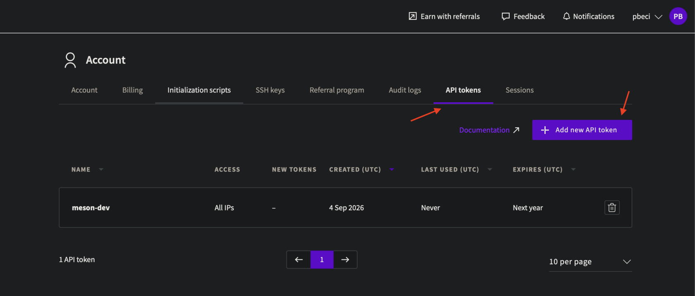

# UpCloud (private Meson)

Create an API-only UpCloud sub-account and API token for Electros. Provider id: **`upcloud`**.

## Create credentials in the UpCloud UI

1. Log in to [hub.upcloud.com](https://hub.upcloud.com) with the UpCloud account that should own these credentials (main account or a sub-account you create for this purpose).
2. Go to **Account** → **Users / Sub-accounts** → **Add user**.
3. Set a **username** and **password**.
4. Enable **Allow API connections**, and leave **Allow control panel login** disabled — API access only, no GUI login.
5. Save. You now have an UpCloud username and password pair.
6. Log in with that sub-account.
7. Open the **Account** page and create a new **API key**.

8. Set a long expiry. Without a valid token, Elemento loses access to your account.
9. Copy the token for Electros.

## Finish in Electros

1. **Connections** → **Add Provider** → **Private** → **UpCloud**.
2. Enter the username, password, and API token as the form requests.
3. **Conclude**, then enable the target on **Active Connections**.
